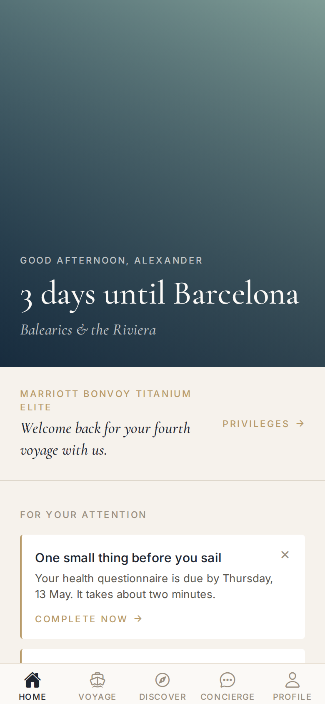
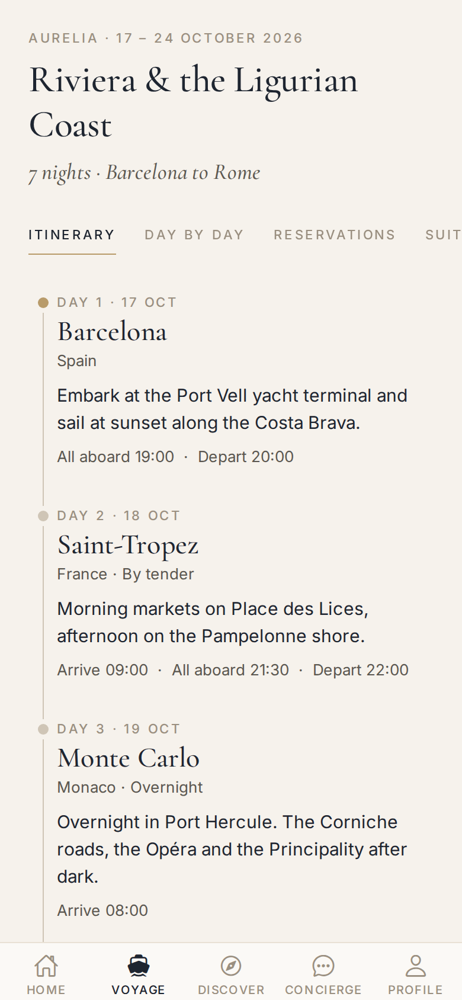
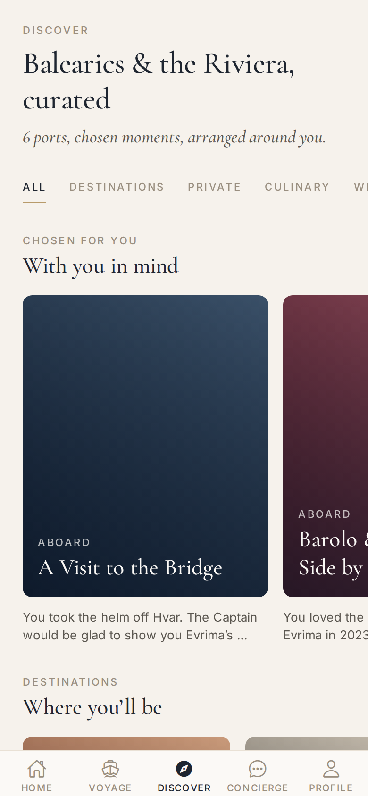
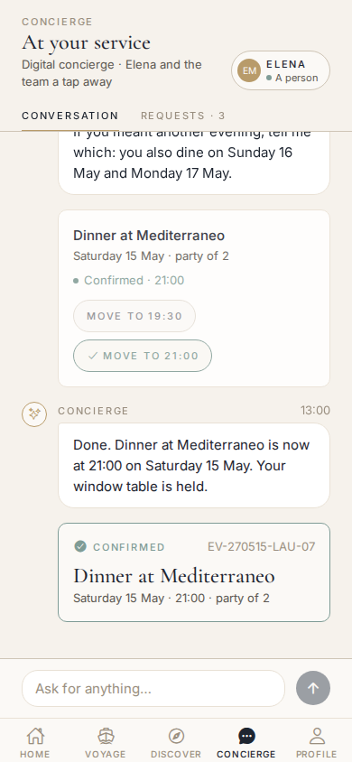
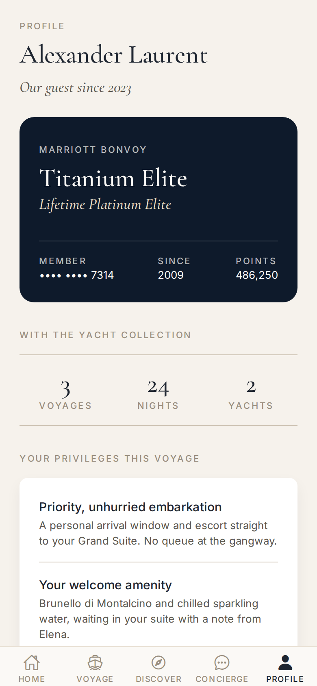

# Yacht Collection: Guest Companion

A mobile digital guest experience concept for an ultra-luxury yacht cruise brand, modelled on The Ritz-Carlton Yacht Collection. It recognises the guest through **Marriott Bonvoy** and orchestrates the whole journey (dream → book → prepare → embark → sail → explore → return → remember → rebook) with voyage management, concierge, curated discovery and continuous service.

> **First iteration.** It contains the architecture and an application shell. Every enterprise service is mocked behind interfaces that can be replaced by enterprise APIs without touching the presentation layer.

## Run it

```bash
npm install
cp .env.example .env        # optional: defaults to mock mode
npx expo start              # press i / a / w for iOS, Android or web
npm run verify              # typecheck + lint (incl. architecture boundaries) + dataset checks
npm run check:fixtures      # 75 integrity checks on the development dataset
npm run doctor              # expo-doctor dependency health
```

The manual QA steps are in [docs/manual-testing-checklist.md](docs/manual-testing-checklist.md).

The demo is pinned to **11 May 2027, 09:00 in Miami**, four days before embarkation. Change `EXPO_PUBLIC_DEMO_NOW` to explore other journey phases.

### Demo story (fictional development dataset)

**Alexander Laurent** (Marriott Bonvoy Titanium Elite, Lifetime Platinum; three previous voyages; flies from Miami) and his wife **Camille** sail aboard *Evrima* in **Grand Suite 612**. The 7-night voyage, *Balearics & the Riviera*, runs Barcelona → Palma de Mallorca → (at sea) → Saint-Tropez → Monte Carlo (overnight) → Portofino → Rome, from 15 to 22 May 2027. Their 20th wedding anniversary falls on 20 May in Monaco, and their Suite Ambassador is Elena Moreau.

He likes Mediterranean cuisine, window tables, sparkling water, red wine, feather-free pillows and private excursions. His interests are fine dining, wine, private cultural experiences, the spa and yachting. The dataset, how it's kept separate from production and how to validate it are described in [`src/data/fixtures/README.md`](src/data/fixtures/README.md).

In **Concierge**, try:

* What is planned for my first day?
* Can you move my dinner reservation?
* What private experiences are available in Monte Carlo?
* Can you arrange transportation?
* What benefits do I have because of my Bonvoy status?
* Can I arrange something special for our anniversary? *(This one hands the conversation to Elena.)*

## Screens

| Home | Voyage | Discover | Concierge | Profile |
|---|---|---|---|---|
|  |  |  |  |  |

*Captured from the web build. Imagery uses brand-tone placeholders until DAM photography is supplied through `MediaAsset.uri`.*

## Architecture

| # | Document |
|---|---|
| 1 | [Product architecture](docs/01-product-architecture.md) |
| 2 | [Enterprise integration architecture](docs/02-enterprise-integration-architecture.md) |
| 3 | [Domain model](docs/03-domain-model.md) |
| 4 | [Database schema](docs/04-database-schema.md) · [SQL](supabase/migrations/) |
| 5 | [Service interfaces](docs/05-service-interfaces.md) · [contracts](src/services/contracts/index.ts) |
| 6 | [Application folder structure](docs/06-application-folder-structure.md) |
| 7 | [Design system](docs/07-design-system.md) · [tokens](src/theme/tokens.ts) |
| 8 | [Navigation model](docs/08-navigation-model.md) |
| 9 | [Security architecture](docs/09-security-architecture.md) |
| 10 | [Personalization architecture](docs/10-personalization-architecture.md) |
| 11 | [Concierge AI architecture](docs/11-concierge-ai-architecture.md) |
| 12 | [Special occasions and service requests](docs/12-occasions-and-service-requests.md) |
| 13 | [Contextual notifications and push](docs/13-notifications.md) |
| 14 | [Service recovery and goodwill rules](docs/14-service-recovery.md) |
| 15 | [Shoreside-to-yacht continuity](docs/15-shoreside-continuity.md) |

### Replacing mocks with enterprise APIs

Screens depend only on `src/services/contracts`, which they reach through `useServices()`. Implementations are chosen in one place, `src/services/registry.ts`, from `EXPO_PUBLIC_SERVICE_MODE`:

* `mock` (default): fictional fixtures.
* `supabase`: every service on Supabase (`src/services/supabase/`).
* `enterprise`: mocks plus enterprise adapters, such as `MarriottBonvoyService` against the backend-for-frontend.

See [docs/05](docs/05-service-interfaces.md#implementations-and-modes).

## Stack

* **Mobile:** Expo SDK 57 · React Native 0.86 · TypeScript (strict) · Expo Router (typed routes) · expo-secure-store · expo-image
* **Backend (MVP):** Supabase (PostgreSQL + RLS, Auth, Storage, Realtime, Edge Functions on Deno)

## Supabase

```bash
supabase start && supabase db reset          # applies migrations + supabase/seed.sql (fictional)
supabase functions serve                     # concierge-respond, journey-events, personalization-next-best, notifications-dispatch, service-recovery-scan
supabase secrets set CONCIERGE_AI_PROVIDER=mock PSEUDONYM_SALT=... JOURNEY_EVENTS_HMAC_SECRET=...
# To connect Claude to the concierge (function secrets only, never in the app):
supabase secrets set CONCIERGE_AI_PROVIDER=anthropic ANTHROPIC_API_KEY=... # optional CONCIERGE_AI_MODEL=...
```

The concierge's server pipeline is described in [docs/11](docs/11-concierge-ai-architecture.md). It covers validation, minimised context, structured output, guards, transactions only through the booking services, escalation and audit.

Run the app against it:

1. In local Studio (Authentication → Users), **invite** `alexander.laurent@example.com`. Accounts are never created from the app. Once confirmed, the account is linked to the fictional guest.
2. In `.env`, set `EXPO_PUBLIC_SERVICE_MODE=supabase`, `EXPO_PUBLIC_SUPABASE_URL=http://127.0.0.1:54321` and the **anon** key from `supabase status`. Restart with `npx expo start --clear`.
3. Sign in with the six-digit code. Locally it arrives in the CLI's mail viewer (`http://127.0.0.1:54324`).

The app refuses to start if the key you configure is a service-role or secret key.

Tests: `npm run check:supabase` runs in `verify` and needs nothing. `npm run test:supabase` runs every migration, SQL test and the app's Supabase services against PostgreSQL + PostgREST; see [docs/04](docs/04-database-schema.md#testing). After changing fixtures, run `npm run seed:generate`.

## Security notes

* Only `EXPO_PUBLIC_*` values are bundled into the app. These are the Supabase URL and anon key, both protected by RLS. A service-role key there stops the app at start-up.
* Service-role, Bonvoy, AI (`ANTHROPIC_API_KEY`), push (`EXPO_ACCESS_TOKEN`, `NOTIFICATIONS_CRON_SECRET`) and webhook secrets live only in Edge Function secrets. Push tokens are stored server-side and never readable back by the app.
* Tokens are stored in the Keychain or Keystore.
* All data is fictional.
