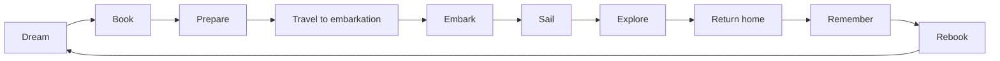
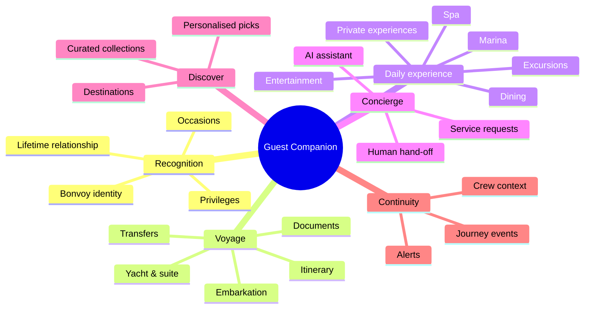

# 1 · Product Architecture

## Vision

A digital luxury travel companion that **recognises the guest and orchestrates the whole journey**. It doesn't replace the crew. It extends the Suite Ambassador's attention to the months before embarkation and the months after the guest returns home.

> The app should feel like a beautifully written note from someone who knows you, not like a cruise-line portal.

## Product principles

| Principle | What it means in practice |
|---|---|
| **Recognition over rewards** | Bonvoy status and voyage history appear as one quiet line ("Welcome back for your third voyage"). Points are visible only in Profile, in small type. |
| **Already handled** | Every disruption message leads with what has *already* been done ("Your driver has been informed"), then any action the guest needs to take. |
| **One clear next thing** | Each screen has one primary focus. Home answers "what's next for me?". |
| **Human always one tap away** | The Suite Ambassador is named, and the guest can reach them from Concierge at any time. The AI never blocks the path to a person. |
| **Contextual, not exhaustive** | Content follows the journey phase. Embarkation leads before the voyage; the day's programme leads at sea. |
| **Discretion** | Occasions carry a `recognition` level (`celebrate` / `discreet` / `private`), and the crew respects it. |

## Journey model

The application is organised around ten journey phases. `VoyageService.getJourneyPhase()` resolves the current phase, and every tab reads it from `useJourney()` to adjust its content.

| Phase | Home leads with | Primary services |
|---|---|---|
| Dream | Editorial destinations, past voyages | Discover, Personalization |
| Book | Suite selection, privileges preview | Voyage (reservations PMS) |
| Prepare | Countdown, documents, preferences, pre-booking | Voyage, Experience, Profile |
| Travel to embarkation | Flight + transfer status, arrival window | Journey events, Experience (transfers) |
| Embark | Suite ready, welcome, safety briefing | Voyage (embarkation), Concierge |
| Sail | The day ahead, dining tonight, all-aboard time | Experience, Concierge, Journey events |
| Explore | Today ashore, private guides, return tender | Experience (excursions), Destination services |
| Return home | Disembark transfer, folio | Experience, Voyage |
| Remember | Voyage memories, thank-you from the crew | Profile, Personalization (feedback) |
| Rebook | "Your next horizon", tailored to what they loved | Personalization, Voyage |

The MVP shell pins the demo clock to **15 October 2026**, two days before embarkation (the *Prepare* phase). Set `EXPO_PUBLIC_DEMO_NOW` to show other phases.

## Capability map

## Personas

* **Lead guest.** Isabelle Laurent-Hale is a Bonvoy Titanium Elite member on her third voyage. She is celebrating her 25th anniversary aboard.
* **Travel companion.** James Hale is pescatarian and a keen open-water swimmer. He has his own login with the `travel_companion` role.
* **Suite Ambassador** (Sophie Marchetti). She sees guest context, preferences and open requests in a future crew console that runs on the same services.
* **Shoreside concierge / Destination services.** They own pre-voyage requests and private shore arrangements.

## MVP scope (this iteration)

1. Architecture artefacts (this folder).
2. An application shell with five tabs (Home, Voyage, Discover, Concierge, Profile) running entirely on mock services.
3. A Supabase schema with row-level security (RLS), plus Edge Function skeletons for the concierge, journey events and personalization.

**Out of scope for now:** booking flows, payments, real authentication screens, the crew console, push notifications and offline sync.
