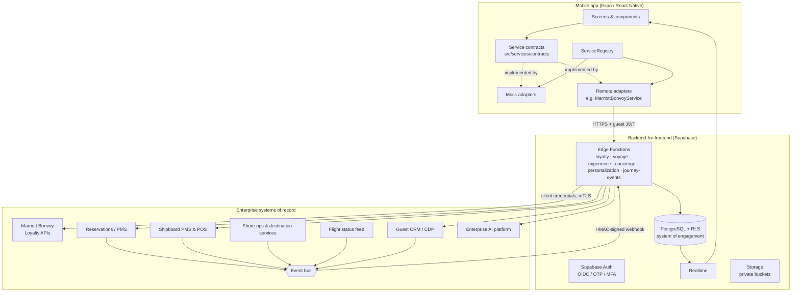

# 2 · Enterprise Integration Architecture

## Layers

## Key decisions

| # | Decision | Rationale |
|---|---|---|
| ADR-01 | **The presentation layer depends only on service contracts** (`src/services/contracts`). | Mocks can be replaced by enterprise adapters one bounded context at a time, with no change to any screen. |
| ADR-02 | **The device talks only to the backend-for-frontend (BFF)**, never to Bonvoy, the PMS or the AI provider directly. | No partner credentials in the app. One place for PII minimisation, mapping, caching and audit. |
| ADR-03 | **Supabase is the system of engagement, not the system of record.** | Rows sourced from integrations carry `(source_system, external_id)`. Enterprise systems stay authoritative. |
| ADR-04 | **Event-driven continuity.** | Disruptions such as a late flight, a weather change or a cancelled excursion arrive as `JourneyEvent`s and are projected into calm guest alerts plus crew tasks. |
| ADR-05 | **AI behind a provider interface** (`ConciergeAIProvider`). | Swap a rules-based mock for an enterprise LLM platform. The policy, tool access and guardrails stay server-side. |
| ADR-06 | **Read models shaped for screens** (`VoyageOverview`, `LoyaltyRecognition`). | Keeps mobile round-trips low. The BFF composes data from several systems. |

## Adapter catalogue

| Contract | MVP | Target adapter | Upstream |
|---|---|---|---|
| `AuthService` | `MockAuthService` | `SupabaseAuthService` (Bonvoy OIDC federation + e-mail OTP) | Supabase Auth, Marriott IdP |
| `LoyaltyService` | `MockLoyaltyService` | `MarriottBonvoyService` (skeleton included) | Bonvoy member, tier and benefits APIs |
| `VoyageService` | `MockVoyageService` | `ReservationsVoyageService` | Reservations PMS, fleet master data |
| `ExperienceService` | `MockExperienceService` | `ShipboardExperienceService` | Shipboard PMS/POS, spa system, shore-ops catalogue |
| `ConciergeService` | `MockConciergeService` + `MockConciergeAI` | `SupabaseConciergeService` + `EnterpriseConciergeAIProvider` | Concierge platform, AI platform |
| `PersonalizationService` | `MockPersonalizationService` | `DecisioningPersonalizationService` | CDP / feature store / model serving |
| `JourneyEventService` | `MockJourneyEventService` | `RealtimeJourneyEventService` | Event bus → `journey-events` function → Realtime |
| `GuestProfileService` | `MockGuestProfileService` | `CrmGuestProfileService` | CRM golden record |
| `AuditService` | `ConsoleAuditService` | `RemoteAuditService` | `audit_log` table and the security information and event management (SIEM) system |

Adapters are selected in `src/services/registry.ts` from `EXPO_PUBLIC_SERVICE_MODE`, and they can be mixed during a phased rollout. For example, live Bonvoy recognition can run alongside mock shipboard data.

## Integration patterns

* **Request/response** (BFF → enterprise): REST/GraphQL over mTLS with OAuth2 client credentials. Every call carries a correlation ID (`X-Request-Id`). Circuit breakers fall back to cached projections in Postgres, so the guest still sees their last-known itinerary.
* **Inbound events** (enterprise → BFF): a CloudEvents-style envelope, HMAC-signed with a five-minute replay window. Processing is idempotent on `dedupe_key`; see `supabase/functions/journey-events`.
* **Outbound commands** (BFF → enterprise), such as booking requests and service requests: written to Postgres first, then relayed via an outbox so a request is never lost while the yacht is on limited satellite bandwidth.
* **Ship ↔ shore connectivity.** Shipboard systems may be intermittently connected. The event bus buffers messages, and the app treats every booking as a *request* (`received → in_progress → confirmed`) rather than a synchronous transaction.

## Service continuity events

| Event | Producer | Guest projection | Crew / ops reaction |
|---|---|---|---|
| `flight.delayed` | Flight status feed | "BA478 is running late. Your driver has been informed." | Re-time the transfer; notify the gangway team if the delay affects embarkation |
| `transfer.delayed` | Ground transport partner | New pick-up time; embarkation unaffected | Shore ops task |
| `embarkation.changed` | Shore ops | Action: review the new window | Update terminal staffing |
| `dining.cancelled` | Shipboard POS | "Alternatives prepared" + link to Concierge | Suite Ambassador proposes options |
| `excursion.cancelled` | Destination services | Alternatives + automatic refund | Destination services task |
| `weather.disruption` | Bridge / ops | Course change; shore bookings adjusted | Re-plan the marina and tenders |
| `itinerary.port_changed` | Fleet ops | New port + revised schedule | Rebook excursions in bulk |
| `service.request_updated` | Concierge platform | Status change | n/a |
| `medical.assistance_requested` | App / suite phone | "Help is on the way" | Page the medical team (urgent) |
| `occasion.anniversary` / `occasion.birthday` | CRM scheduler | *None* (kept as a gesture) | Suite Ambassador briefing; amenity |
