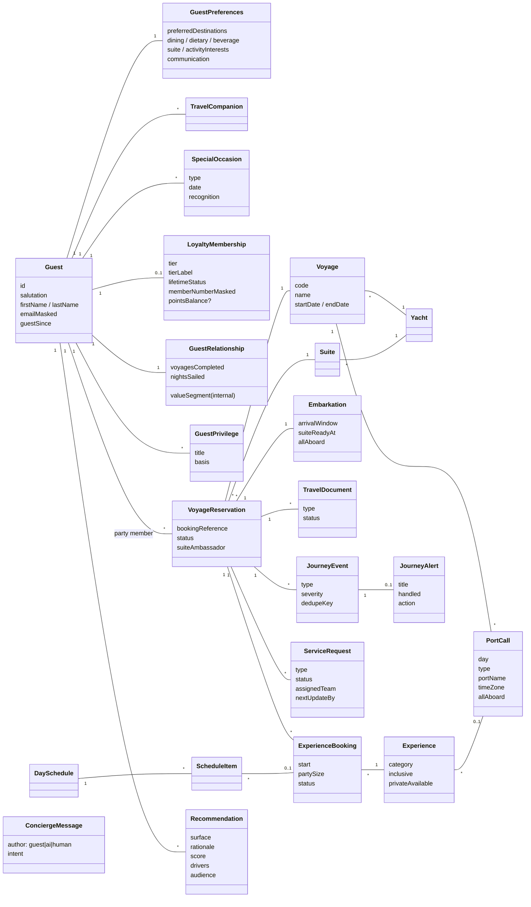

# 3 · Domain Model

The TypeScript source of truth is `src/domain/*.ts`. It is grouped into bounded contexts that line up with the service contracts.

## Bounded contexts

| Context | Aggregates | Owner (system of record) |
|---|---|---|
| **Guest** | `GuestProfile` (Guest, Preferences, Companions, Occasions) | CRM |
| **Loyalty** | `LoyaltyRecognition` (Membership, Relationship, Privileges) | Marriott Bonvoy (membership), CRM (relationship) |
| **Voyage** | `VoyageOverview` (Reservation, Voyage, Yacht, Suite, Embarkation, Documents) | Reservations PMS |
| **Experience** | Experience catalogue, `ExperienceBooking`, `DaySchedule` | Shipboard PMS/POS, shore ops |
| **Concierge** | Conversation, `ConciergeMessage`, `ServiceRequest` | Concierge platform |
| **Continuity** | `JourneyEvent` → `JourneyAlert` | Event bus |
| **Personalization** | `Recommendation`, signals, feedback | Decisioning platform |

## Modelling rules

* **Times carry the port's offset.** For example, `2026-10-17T20:30:00+02:00`. The UI shows wall-clock port time, so a guest at home in London still sees "20:30" for dinner in Barcelona.
* **Money is held in minor units** (`amountMinor`) with an ISO currency code.
* **Imagery is a `MediaAsset`.** It holds a DAM `uri` plus a brand `tone` gradient used as a graceful fallback.
* **PII arrives masked** (`emailMasked`, `memberNumberMasked`). Full values are fetched only in explicit, audited flows.
* **Internal-only fields** such as `GuestRelationship.valueSegment` and `Recommendation.audience = 'crew'` are never rendered in the guest app. RLS also keeps them out of guest queries (see the schema).
* **Bookings are requests.** `RequestStatus` models the hospitality reality that the crew confirms, proposes an alternative, or declines.
