# 4 · Database Schema (Supabase / PostgreSQL)

The executable DDL is in four migrations, applied in order:

| Migration | Adds |
|---|---|
| `20261002000000_init.sql` | Core schema, RLS helpers and policies, storage bucket, Realtime |
| `20261003000000_preferences_v2.sql` | Editable preference groups, optimistic concurrency, preference audit |
| `20261004000000_supabase_integration.sql` | Everything the app needs in `supabase` mode: auth linking, audit fields, new entities, booking functions, local-time views, privilege hardening |
| `20261005000000_concierge_links.sql` | `service_requests.experience_id` / `booking_id`, so Concierge shows a request on the right card; guests may link only their own booking or an active experience on the voyage |

All four are verified against PostgreSQL 16 by the SQL smoke tests and by the end-to-end suite (`npm run test:supabase`, below).

## Entity–relationship overview

```mermaid
erDiagram
  guests ||--o| loyalty_memberships : has
  guests ||--|| guest_relationships : has
  guests ||--|| guest_preferences : has
  guests ||--o{ travel_companions : travels_with
  guests ||--o{ guest_occasions : celebrates
  guests ||--o{ guest_privileges : holds
  privileges ||--o{ guest_privileges : granted_as
  guests ||--o{ notifications : receives
  guests ||--|| guest_pii : "private schema"
  yachts ||--o{ suites : contains
  yachts ||--o{ voyages : sails
  voyages ||--o{ port_calls : calls_at
  voyages ||--o{ reservations : booked_as
  reservations ||--o{ reservation_guests : party
  guests ||--o{ reservation_guests : member_of
  reservations ||--|| embarkations : embarks
  reservations ||--o{ travel_documents : requires
  experiences ||--o{ experience_bookings : booked_as
  reservations ||--o{ experience_bookings : holds
  voyages ||--o{ activities : programme
  voyages ||--o{ voyage_days : days
  reservations ||--o{ flight_segments : flies
  experiences ||--o{ experience_slots : bookable_at
  experience_bookings ||--o| dining_bookings : dining
  experience_bookings ||--o| spa_bookings : spa
  experience_bookings ||--o| excursion_bookings : ashore
  voyages ||--o{ destinations : visits
  voyages ||--o{ discover_collections : curates
  reservations ||--o{ concierge_conversations : converses
  concierge_conversations ||--o{ concierge_messages : contains
  reservations ||--o{ service_requests : raises
  service_requests ||--o{ service_request_events : history
  reservations ||--o{ journey_events : affected_by
  journey_events ||--o| journey_alerts : projects
  guests ||--o{ personalization_signals : emits
  guests ||--o{ recommendations : receives
  recommendations ||--o{ recommendation_feedback : feedback
```



## Table groups

| Group | Tables | Notes |
|---|---|---|
| Identity & access | `guests`, `private.guest_pii`, `user_roles` | Raw PII lives in a schema that PostgREST cannot reach. Roles can be scoped to a yacht. |
| Loyalty | `loyalty_memberships`, `guest_relationships`, `privileges`, `guest_privileges` | A projection of Bonvoy. `guest_relationships` is crew-only; guests call `my_relationship()`. |
| Fleet & voyage | `yachts`, `suites`, `voyages`, `port_calls`, `reservations`, `reservation_guests`, `embarkations`, `travel_documents` | Document files go in the private `travel-documents` bucket, under `<guest_id>/…`. |
| Preferences | `guest_preferences` (JSONB per domain), `travel_companions`, `guest_occasions` | Dietary data is health-adjacent: treated as special-category data. |
| Experiences | `experiences`, `experience_slots`, `destinations`, `discover_collections`, view `excursions` | The catalogue is read-only to guests. |
| Bookings | `experience_bookings` + `dining_bookings`, `spa_bookings`, `excursion_bookings` (1:1 details) | Guests may only *insert* requests (`status = 'received'`); changes and cancellations go through two functions. |
| Programme | `voyage_days`, `activities` (was `day_schedule_items`), `flight_segments`, view `voyage_guests` | Ship-wide activities have no reservation; booking lines and suggestions belong to the party. |
| Concierge | `concierge_conversations`, `concierge_messages`, `service_requests`, `service_request_events` | Only the Edge Function (service role) writes AI-authored messages. |
| Continuity | `journey_events`, `journey_alerts`, `notifications` | Raw events are crew-only; guests see the alert projection and may only acknowledge. Notifications are sent server-side; guests may only set `read_at`. |
| Personalization | `personalization_signals`, `recommendations`, `recommendation_feedback` | `audience = 'crew'` rows are invisible to guests. `model_version` is stored for explainability. |
| Audit | `audit_log` | Append-only: a trigger rejects UPDATE and DELETE. Only admins can read it. |

## Row-level security model

The policies rely on four helpers, all `SECURITY DEFINER` and `STABLE`:

* `current_guest_id()` maps `auth.uid()` to the guest's row.
* `on_reservation(res)` is true when the caller belongs to the reservation's party.
* `crew_for_reservation(res)` is true when the caller holds a crew role on that reservation's yacht, or holds a global shoreside/admin role.
* `has_role(role)` and `is_crew()`.

The policy pattern is **party or crew**. A guest reaches a reservation, and everything hanging off it, only when they are on its party. Crew can reach it only when the reservation is on their yacht. Column-level grants stop guests rewriting provenance (`guests`) and alert content (`journey_alerts`).

Smoke-tested assertions (`supabase/tests/10_rls_smoke.sql`):

| Check | Result |
|---|---|
| A guest sees their own reservation | ✅ |
| A guest cannot read `guest_relationships` (internal segment) | ✅ |
| A guest gets the safe relationship through `my_relationship()` | ✅ |
| A guest sees only `audience = 'guest'` recommendations | ✅ |
| Another guest cannot see the reservation | ✅ |
| Crew on the yacht can see the reservation and the guest | ✅ |
| The `authenticated` role has no access to schema `private` | ✅ |
| `audit_log` UPDATE is rejected | ✅ |

To run every SQL test and the service suite against plain Postgres and PostgREST (no Docker), see [Testing](#testing). With the Supabase CLI, `supabase db reset` applies the migrations and `supabase/seed.sql` without the stubs.

## Preferences v2 (`20261003000000_preferences_v2.sql`)

* New JSONB groups: `excursions`, `spa`, `transportation`, `accessibility`, `privacy`.
* `version` for optimistic concurrency. A trigger allows only `version = old + 1` and stamps `updated_at` with server time.
* An audit trigger records the actor, the changed group names and the version. It never records values, because dietary and accessibility data are special-category.
* Crew read access requires the guest's `accessibility.shareWithCrew` consent.
* `supabase/tests/20_preferences_smoke.sql` checks: own-row writes, stale and skipped versions refused, another guest denied, crew access following consent, and the audit content.

## Realtime

`concierge_messages`, `service_requests` and `journey_alerts` are published to `supabase_realtime`. RLS applies to Realtime as well, so guests only receive their own rows.

## Supabase integration (`20261004000000_supabase_integration.sql`)

### Authentication

* Self-signup stays disabled (`config.toml`). A guest is **invited** (Studio, or the admin API from the reservations sync) using the e-mail held in `private.guest_pii`.
* When that account's e-mail is confirmed, the trigger `private.link_auth_user()` on `auth.users` links it to the **one** guest with that e-mail who is not yet linked, and grants `guest` (lead guest) or `travel_companion`.
* It links nothing when the e-mail is unconfirmed, unknown, shared by two guests, or already linked; each refusal is written to `audit_log`.
* The app signs in with a six-digit e-mail code (`shouldCreateUser: false`), so it can never create an account.

### Audit fields

Every domain table has `created_at`, `updated_at`, `created_by` and `updated_by`, stamped by `private.set_audit_fields()`:

* For an end-user request, the server sets all four from `now()` and `auth.uid()`, whatever the client sends.
* For a migration, seed or service-role sync, source timestamps are kept.
* On update, `created_*` cannot change.

`created_by` and `updated_by` are deliberately not foreign keys, so the trail survives account deletion. Append-only logs (`audit_log`, `concierge_messages`, `service_request_events`, `journey_events`, `personalization_signals`, `recommendation_feedback`) keep their own timestamps.

Row changes on guest-writable tables are written to `audit_log` by `private.audit_row_change()`. This covers bookings, service requests, conversations, companions, occasions, alerts and notifications. Each entry records the actor, roles, action and **the names of the changed columns, never their values**.

### Entities added

| Table | Purpose | Guest access |
|---|---|---|
| `guest_privileges` | Privileges a guest holds, optionally for one voyage | read own |
| `voyage_days` | Headline, dress code, sunset per day | read |
| `activities` (renamed) | Day programme; `category`, `time_zone` added | read ship-wide and own party's |
| `flight_segments` | Flights to and from the voyage, with origin and destination zones | read own party |
| `experience_slots` | Bookable times and places remaining | read (active experiences) |
| `destinations`, `discover_collections` | Discover editorial | read |
| `dining_bookings`, `spa_bookings`, `excursion_bookings` | Per-kind booking detail (table, pressure, meeting point) | read own party; crew manage |
| `notifications` | Outbound communication history and schedule | read own; update `read_at` only |
| `recovery_notices` | What the guest is told about a disruption (guest-safe) | party read; answer via `respond_to_recovery_notice()` |
| `service_recovery_events`, `goodwill_proposals` | Recorded recoveries and goodwill proposals | none (crew only) |
| `guest_occasions` (renamed) | Occasions; private ones hidden from crew | own |
| view `voyage_guests` | The guests on each voyage, with the lead flagged | follows `reservation_guests` |
| view `excursions` | Shore experiences | follows `experiences` |

Columns were also added: `guests.home_airport`, `guest_relationships.yachts_sailed`, `hero` imagery JSON, and experience `format`, `includes`, `destination`, availability and `sort_order`. The other new columns are `reservations.suite_ambassador_contact`, `embarkations.luggage`, `service_requests.assigned_to_name`, and `journey_alerts.event_type` and `expires_at`.

### Functions the app calls

| Function | Does |
|---|---|
| `my_relationship()` | The guest's tenure (with yachts sailed), never the internal value segment |
| `my_personal_details()` | Nationality only; date of birth, passport and raw contact details stay private |
| `request_experience_booking_change(id, starts_at?, party_size?, note?)` | Party members only; sets `in_progress` for the crew to confirm |
| `cancel_experience_booking(id)` | Party members only; refuses completed, declined or already cancelled bookings |
| `current_guest_id()` | The signed-in guest's ID |

Booking requests are a plain insert. The policy accepts only:

* `received` status;
* the caller's own reservation;
* an active experience on that voyage;
* no provenance fields.

The trigger then sets the category, the title and the time zone from the catalogue.

### Times

Times are stored as `timestamptz` plus the IANA zone where they happen. `iso_local(ts, zone)` formats an ISO string with that zone's offset (`2027-05-15T20:30:00+02:00`). The `*_local` views (`port_calls_local`, `embarkations_local`, `experience_bookings_local`, `activities_local`, `experience_slots_local`, `flight_segments_local`, `voyage_days_local`, `notifications_local`, `service_requests_local`, `journey_alerts_local`) return those strings. That is what the app shows: port time, not device time. Every view is `security_invoker`, so the RLS of the underlying table applies.

### Privileges

* `anon` has no table, view, sequence or function in `public`; the anon key is only for the sign-in endpoints.
* Client roles cannot create objects in `public`.
* Guests cannot write reference data, loyalty projections, the programme, roles or the audit log, even where a policy would allow it.
* The migration fails if any `public` table lacks RLS or any view is not `security_invoker`.

### Seed (`supabase/seed.sql`)

Generated from the fictional dataset by `npm run seed:generate`, so do not edit it by hand.

* IDs are deterministic UUID v5s of the fixture IDs.
* Every row has `source_system = 'mock'`, and e-mail addresses use `example.com`.
* It creates no auth users or roles, and refuses to run against a database holding non-fictional guests.
* `npm run check:supabase` fails if the seed is out of date.

## Concierge AI (`20261006000000_concierge_ai.sql`)

* `concierge_messages.classification` (`information` / `recommendation` / `transactional`) is set on AI answers. The guest insert policy refuses a classification or a confidence on guest messages.
* `concierge_ai_runs` holds one row per answered request, written by `concierge-respond` (service role). It records the provider and model, prompt version, classification, context slices, safety flags, guard findings, escalation, transaction outcome, degradation, attempts, latency, usage and message IDs. It never holds text. `request_id` is unique, which is what makes retries idempotent. Crew on the yacht can read it; guests cannot read or write it.
* See [11 · Concierge AI](11-concierge-ai-architecture.md).

## Guest service requests (`20261007000000_guest_service_requests.sql`)

* `service_requests` gains:
  * `category` (10 values, backfilled from `type`);
  * `guest_id`;
  * `resolution_notes`;
  * lifecycle stamps `acknowledged_at`, `started_at`, `resolved_at`, `closed_at`;
  * `occasion_step` (the celebration-plan step a request came from).
* The `service_request_lifecycle` trigger fills defaults on insert and stamps each status change.
* The guest insert policy allows the opening state only.
* `close_service_request()` is the guest's only change: withdraw a received request, or close a resolved one.
* `service_requests_local` exposes the new columns in local time.
* See [12](12-occasions-and-service-requests.md).

## Notifications (`20261008000000_notifications.sql`)

* `notifications` gains:
  * `type` (the seven guest-facing types, backfilled from `category`);
  * `dedupe_key` (unique per guest, the engine's key, so a push is recorded once);
  * `push_status` and `push_ticket`.
* `notification_receipts(guest_id, notification_key, read_at)` holds the read state of contextual notifications. A guest reads and inserts their own only.
* `push_devices` holds Expo push tokens:
  * registered only through `register_push_device()`;
  * a guest sees their own devices (no token column) and may remove them;
  * disabled when Expo reports a dead token.
* `activities` gains `previous_starts_at` and `changed_at` (and `activities_local` their local times), so a moved programme item becomes an itinerary change.
* See [13](13-notifications.md).

## Service recovery (`20261009000000_service_recovery.sql`)

* **`service_recovery_events`**: one row per disruption (`disruption_key` unique). It holds:
  * kind, source, severity, owner, escalation, follow-up time and status;
  * the full disruption (internal reason and quotes included);
  * the plan (steps, crew brief, alternatives offered).
  
  Crew assigned to the reservation read it; only the service role writes it.
* **`recovery_notices`**: the guest-safe side of each event.
  * The party and crew read it.
  * A check refuses an internal reason, quotes or guest ids.
  * Guests answer only through `respond_to_recovery_notice()`: one alternative, or a request for help. Either must be on the same reservation.
* **`goodwill_rules`**: business rules for goodwill. Crew read, admins write. Checks:
  * an approved rule names who authorised it, and when;
  * a rule that moves money has a ceiling and an admin as approver.
* **`goodwill_policy`**: one row; `financial_enabled` is false.
* **`goodwill_proposals`**: crew read.
  * They are decided only through `decide_goodwill_proposal()`, which checks the role, the policy, the rule as it stands now, and the limit.
  * An approval records authority to act; it applies nothing.
* See [14](14-service-recovery.md).

## Continuity (`20261010000000_continuity.sql`)

* `flight_segments.estimated_arrival` holds the latest estimate (also in `flight_segments_local`).
* `arrival_updates` holds what the guest reads when travel to the yacht changes: guest-safe JSON, one per plan key. The party and crew read it; the service role writes it.
* `continuity_tasks` holds the changes a delay requires, one per team (transfer, venue, embarkation, crew). Crew assigned to the reservation read them.
  * No supplier or PMS integration exists, so these are tasks for people.
  * Bookings are not changed until a team confirms.
* See [15](15-shoreside-continuity.md).

## Testing

| Command | Needs | Covers |
|---|---|---|
| `npm run check:supabase` (in `verify`) | nothing | Seed freshness; key and URL validation; sign-in logic against a fake client; keychain chunking; mapping and error codes; static scans (no service-role key in app code, RLS on every table, `security_invoker` views, pinned `search_path`) |
| `npm run test:supabase` | `PG_BIN` (PostgreSQL 15+) and `POSTGREST` (PostgREST 12) | Throwaway cluster: stubs, migrations, seed. Runs the 67 SQL assertions in `supabase/tests/10_*`, `20_*` and `30_*`, then 113 checks running the **app's Supabase services through supabase-js → PostgREST → RLS**, compared with the mock services, plus the writes and refusals for the guest, another guest and the anon key, and the **concierge pipeline end to end** (mock model, real RLS and booking functions) |

```bash
PG_BIN=/usr/lib/postgresql/16/bin POSTGREST=~/bin/postgrest npm run test:supabase
```
