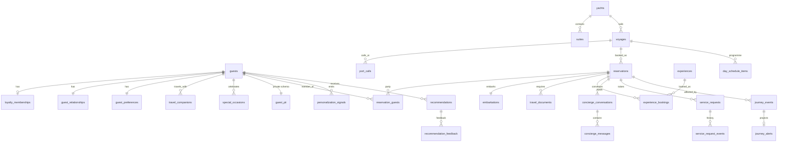

# 4 · Database Schema (Supabase / PostgreSQL)

The executable DDL is in `supabase/migrations/20261002000000_init.sql`. It has been verified against PostgreSQL 16, together with the RLS smoke test in `supabase/tests/`.

## Entity–relationship overview



## Table groups

| Group | Tables | Notes |
|---|---|---|
| Identity & access | `guests`, `private.guest_pii`, `user_roles` | Raw PII lives in a schema that PostgREST cannot reach. Roles can be scoped to a yacht. |
| Loyalty | `loyalty_memberships`, `guest_relationships`, `privileges` | A projection of Bonvoy. `guest_relationships` is crew-only; guests call `my_relationship()`. |
| Fleet & voyage | `yachts`, `suites`, `voyages`, `port_calls`, `reservations`, `reservation_guests`, `embarkations`, `travel_documents` | Document files go in the private `travel-documents` bucket, under `<guest_id>/…`. |
| Preferences | `guest_preferences` (JSONB per domain), `travel_companions`, `special_occasions` | Dietary data is health-adjacent: treated as special-category data. |
| Experiences | `experiences`, `experience_bookings`, `day_schedule_items` | Guests may only *insert* bookings with `status = 'received'`; the crew updates them. |
| Concierge | `concierge_conversations`, `concierge_messages`, `service_requests`, `service_request_events` | Only the Edge Function (service role) writes AI-authored messages. |
| Continuity | `journey_events`, `journey_alerts` | Raw events are crew-only; guests see the alert projection. `dedupe_key` is unique. |
| Personalization | `personalization_signals`, `recommendations`, `recommendation_feedback` | `audience = 'crew'` rows are invisible to guests. `model_version` is stored for explainability. |
| Audit | `audit_log` | Append-only: a trigger rejects UPDATE and DELETE. Only admins can read it. |

## Row-level security model

The policies rely on four helpers, all `SECURITY DEFINER` and `STABLE`:

* `current_guest_id()` maps `auth.uid()` to the guest's row.
* `on_reservation(res)` is true when the caller belongs to the reservation's party.
* `crew_for_reservation(res)` is true when the caller holds a crew role on that reservation's yacht, or holds a global shoreside/admin role.
* `has_role(role)` and `is_crew()`.

The policy pattern is **party or crew**. A guest reaches a reservation, and everything hanging off it, only when they are on its party. Crew can reach it only when the reservation is on their yacht. Column-level grants stop guests rewriting provenance (`guests`) and alert content (`journey_alerts`).

Smoke-tested assertions (`supabase/tests/10_rls_smoke.sql`):

| Check | Result |
|---|---|
| A guest sees their own reservation | ✅ |
| A guest cannot read `guest_relationships` (internal segment) | ✅ |
| A guest gets the safe relationship through `my_relationship()` | ✅ |
| A guest sees only `audience = 'guest'` recommendations | ✅ |
| Another guest cannot see the reservation | ✅ |
| Crew on the yacht can see the reservation and the guest | ✅ |
| The `authenticated` role has no access to schema `private` | ✅ |
| `audit_log` UPDATE is rejected | ✅ |

To run it locally against plain Postgres:

```bash
createdb rcyc && psql -d rcyc -f supabase/tests/00_local_stubs.sql \
  && psql -d rcyc -f supabase/migrations/20261002000000_init.sql \
  && psql -d rcyc -At -f supabase/tests/10_rls_smoke.sql
```

Or run `supabase db reset` with the Supabase CLI, which does not need the stubs.

## Realtime

`concierge_messages`, `service_requests` and `journey_alerts` are published to `supabase_realtime`. RLS applies to Realtime as well, so guests only receive their own rows.
