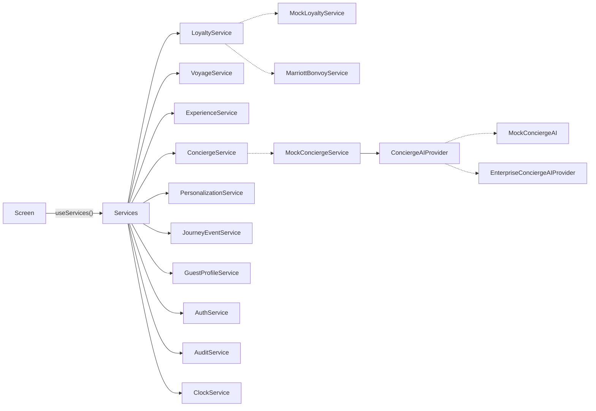

# 5 · Service Interfaces

The source is `src/services/contracts/index.ts`. Screens obtain services only through `useServices()`, and never import an implementation.

## Implementations and modes

`src/services/registry.ts` picks the implementations from `EXPO_PUBLIC_SERVICE_MODE`. Nothing else in the app knows which are in use.

| Contract | `mock` (default) | `supabase` | `enterprise` |
|---|---|---|---|
| AuthService | `MockAuthService` (pre-signed-in; any six-digit code) | `SupabaseAuthService`: e-mail one-time code, keychain session | mock |
| GuestProfileService | `RepositoryGuestProfileService` with `MockGuestRecordSource` + `LocalPreferencesRepository` | the same service with `SupabaseGuestRecordSource` + `SupabasePreferencesRepository` | mock |
| LoyaltyService | `MockLoyaltyService` | `SupabaseLoyaltyService` (Bonvoy projection) | `MarriottBonvoyService` (BFF) |
| VoyageService | `MockVoyageService` | `SupabaseVoyageService` | mock |
| ExperienceService | `MockExperienceService` | `SupabaseExperienceService` | mock |
| ScheduleService | `MockScheduleService` | `SupabaseScheduleService` | mock |
| ConciergeService | `MockConciergeService` + `MockConciergeAI` | `SupabaseConciergeService` (`concierge-respond` Edge Function, Realtime) | mock |
| PersonalizationService | `MockPersonalizationService` + rules engine | `SupabasePersonalizationService` (materialised recommendations) | mock |
| JourneyEventService | `MockJourneyEventService` | `SupabaseJourneyEventService` (alerts, notifications, Realtime) | mock |
| ClockService | pinned demo moment (`?now=`, `EXPO_PUBLIC_DEMO_NOW`) | device clock | device clock |

Rules shared by every implementation live in `src/services/shared/`, so behaviour doesn't depend on the backend:

* `journeyPhase`;
* the calendar merge (`buildCalendar`);
* recommendation merging (curated wins);
* the recognition line and privilege filtering;
* neutral default preferences.

The mock-only test controls (`?scenario=`, `?now=`) have no effect in `supabase` mode.

**Supabase specifics**

* Every read runs as the signed-in guest, so RLS decides what comes back. The guest ID in a call is a filter, not a permission.
* IDs are checked as UUIDs before use. This also stops them altering PostgREST filter strings.
* Database errors map to `ServiceError` codes. `42501` → `forbidden`; `PGRST116`/`P0002` → `not_found`; `23505`/`40001` → `conflict`; check violations → `validation`; network and 5xx → `unavailable` (retryable).
* Times are read from the `*_local` views, so they carry the port's offset as in the mocks.
* `sendMessage` posts only `{ conversationId, body }` to `concierge-respond`. The server builds its own minimised context; the client's `GuestContext` is never sent.
* Bookings are requests. Changes and cancellations go through database functions that allow nothing else.
* Known, intentional differences from the mock:
  * the guest record omits the date of birth;
  * the relationship omits the internal value segment;
  * the concierge greeting is generic;
  * `checkAvailability` returns real slots;
  * `linkMembership` and Bonvoy sign-in report `unavailable` until their server-side flows are configured.

`npm run test:supabase` runs these services against PostgreSQL + PostgREST and compares each read with the mock (see [docs/04](04-database-schema.md#testing)).



## Contracts at a glance

### LoyaltyService
```ts
getMembership(guestId): Promise<LoyaltyMembership | null>
getRelationship(guestId): Promise<GuestRelationship>
getPrivileges(guestId, voyageId?): Promise<GuestPrivilege[]>
getRecognition(guestId, voyageId?): Promise<LoyaltyRecognition>   // read model for Home/Profile
linkMembership(guestId, authorizationCode): Promise<LoyaltyMembership>
```
`MockLoyaltyService` serves it today. `MarriottBonvoyService` (in `src/services/remote/`) is the production client of the BFF `/loyalty/*` routes, which call Bonvoy server-side. **The UI does not change when Bonvoy is connected.**

### VoyageService
Covers reservations, the voyage, the yacht, the suite, the itinerary, embarkation and travel documents, plus `getOverview()` (a composite read model) and `getJourneyPhase()`.

### ExperienceService
Covers dining, spa, excursions, marina, entertainment, transfers and private experiences:
`listBookings`, `getNextBooking`, `getDaySchedule`, `listDaySchedules`, `listCatalogue`, `getExperience`, `listCollections`, `listDestinations`, `checkAvailability`, `requestBooking`, `requestChange`, `cancelBooking`.

### ConciergeService
```ts
openConversation(reservationId)
sendMessage(conversationId, body, context: GuestContext)    // AI-first reply
escalateToHuman(EscalationRequest): Promise<EscalationResult>
createServiceRequest(reservationId, input)
listServiceRequests(reservationId) / getServiceRequest(id)  // request status
subscribe(conversationId, listener)                         // human replies / status pushes
```
Reasoning sits behind `ConciergeAIProvider.respond()`. That method returns `{ messages, confidence, shouldEscalate }`, so the orchestration (persistence, escalation, audit) stays independent of the model.

**Escalation rules (MVP).** The conversation is handed to a person when:
* confidence is below 0.5 on the client mock, or below 0.55 on the server;
* the topic is sensitive (medical, a complaint, refunds); or
* the guest asks, using the named Ambassador button in the header.

Medical requests go to the `medical` team with `urgent` priority.

### ExperienceService.listAvailability
`listAvailability(voyageId): Promise<ExperienceAvailability[]>` returns, per experience:

* a status: `available`, `limited`, `waitlist` or `unavailable`;
* dated slots with remaining places;
* an optional guest-facing note, such as "Four places left".

### PersonalizationService
`getRecommendations(guestId, surface, opts)` and `recordFeedback(guestId, recommendationId, signal)`. Crew-audience opportunities are never returned to the guest app.

**MVP behaviour.** `MockPersonalizationService` serves Home its curated picks. For Discover and Voyage it merges those picks with `MockRecommendationEngine`.

The engine is a transparent, rules-based scorer, **not** a learning system. Weights:

| Signal | Weight |
|---|---|
| A loved past moment with overlapping tags (uses the signal's `memory` phrase and the voyage it happened on) | 0.35 + overlap |
| The occasion this voyage | 0.3–0.5 |
| The travelling companion's interests | 0.3 |
| A stated interest | 0.2 |
| Private style, window table | 0.12–0.15 |
| First visit to the port | 0.05 |
| Group formats ashore, after a poorly rated group tour | −0.3 |

The strongest driver becomes the explanation, for example: "Recommended because you enjoyed a private vineyard lunch on Hvar on your Adriatic voyage in 2024." Curated recommendations always win. Production replaces the engine behind the same contract.

### GuestProfileService and preference persistence
```ts
getProfile(guestId)                       // guest record + latest saved preferences
getPreferences(guestId): VersionedPreferences   // { preferences, version, updatedAt, source }
updatePreferences(guestId, patch, { expectedVersion })   // ServiceError('conflict') if stale
```
`RepositoryGuestProfileService` composes two sources:

* a `GuestRecordSource` for identity, companions, occasions and default preferences (CRM; mock for now);
* a `PreferencesRepository` for what the guest edits.

The registry picks the repository, and the UI never sees which:

| Mode | Record source | Repository | Storage |
|---|---|---|---|
| `supabase` | `SupabaseGuestRecordSource` | `SupabasePreferencesRepository` | `public.guest_preferences`, RLS "own" policy, `version` column (migration `20261003000000`) |
| `mock`, `enterprise` | `MockGuestRecordSource` | `LocalPreferencesRepository` | AsyncStorage (device) or localStorage (web), behind `resilientStore` with a session-memory fallback |

Rules shared by both:

* A patch replaces whole groups.
* A saved group loads exactly as saved, so cleared fields stay cleared.
* Groups missing from older records come from the defaults.
* Every save is validated at the service boundary (temperature, note length, allergy names, quiet hours).
* In Supabase, a trigger audits which groups changed, never their values.

### ScheduleService
`getCalendar(reservationId): Promise<CalendarDay[]>` returns the party's chronological calendar. It merges:

* the voyage programme (yacht events, port times and suggestions);
* every booking (dining, spa, excursions, private experiences, transfers);
* flights, including travel days before and after the voyage.

`MockScheduleService` builds it from the fixtures. In production it's a BFF read model joining the shipboard PMS, shore ops and reservations.

### JourneyEventService
`listAlerts`, `acknowledge`, and `subscribe(reservationId, listener, types?)` for real-time continuity events.

### AuthService, GuestProfileService, AuditService, ClockService
These cover the session, the profile and preferences, advisory client audit, and an injected time source. Mocks pin "now" to a demo moment.

## Conventions

* **Domain types only.** Vendor data transfer objects (DTOs) are mapped in the BFF and never reach the device.
* **Errors.** `ServiceError(code, message, retryable)`, where `code` is one of `unauthenticated | forbidden | not_found | conflict | unavailable | validation | unknown`. Screens map codes to calm copy ("We couldn't reach the yacht just now").
* **No secrets in signatures.** Tokens are attached by the transport (`ApiClient`) from secure storage.
* **Idempotent writes.** Remote adapters send an `X-Request-Id`, and the BFF deduplicates on it.

## Replacing a mock: a checklist

1. Implement the contract: `src/services/remote/<Name>.ts` using `ApiClient` (enterprise BFF), or `src/services/supabase/` (Supabase).
2. Add the matching BFF route or Edge Function, which handles the vendor call, mapping, PII minimisation and audit.
3. Register the adapter in `compose()` in `registry.ts` for its mode.
4. Compare it with the mock on the shared dataset, as `scripts/supabase/integration.ts` does for Supabase.
5. No screen changes are needed.
