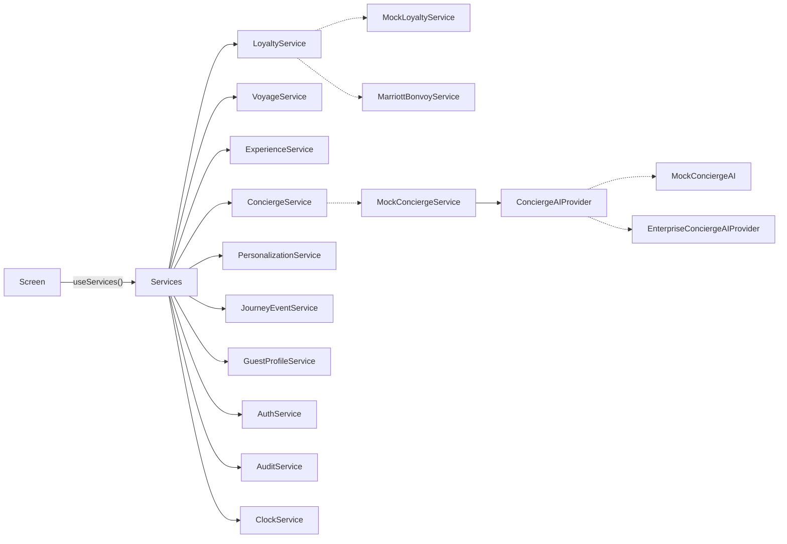

# 5 · Service Interfaces

The source is `src/services/contracts/index.ts`. Screens obtain services only through `useServices()`, and never import an implementation.



## Contracts at a glance

### LoyaltyService
```ts
getMembership(guestId): Promise<LoyaltyMembership | null>
getRelationship(guestId): Promise<GuestRelationship>
getPrivileges(guestId, voyageId?): Promise<GuestPrivilege[]>
getRecognition(guestId, voyageId?): Promise<LoyaltyRecognition>   // read model for Home/Profile
linkMembership(guestId, authorizationCode): Promise<LoyaltyMembership>
```
`MockLoyaltyService` serves it today. `MarriottBonvoyService` (in `src/services/remote/`) is the production client of the BFF `/loyalty/*` routes, which call Bonvoy server-side. **The UI does not change when Bonvoy is connected.**

### VoyageService
Covers reservations, the voyage, the yacht, the suite, the itinerary, embarkation and travel documents, plus `getOverview()` (a composite read model) and `getJourneyPhase()`.

### ExperienceService
Covers dining, spa, excursions, marina, entertainment, transfers and private experiences:
`listBookings`, `getNextBooking`, `getDaySchedule`, `listDaySchedules`, `listCatalogue`, `getExperience`, `listCollections`, `listDestinations`, `checkAvailability`, `requestBooking`, `requestChange`, `cancelBooking`.

### ConciergeService
```ts
openConversation(reservationId)
sendMessage(conversationId, body, context: GuestContext)    // AI-first reply
escalateToHuman(EscalationRequest): Promise<EscalationResult>
createServiceRequest(reservationId, input)
listServiceRequests(reservationId) / getServiceRequest(id)  // request status
subscribe(conversationId, listener)                         // human replies / status pushes
```
Reasoning sits behind `ConciergeAIProvider.respond()`. That method returns `{ messages, confidence, shouldEscalate }`, so the orchestration (persistence, escalation, audit) stays independent of the model.

**Escalation rules (MVP).** The conversation is handed to a person when:
* confidence is below 0.5 on the client mock, or below 0.55 on the server;
* the topic is sensitive (medical, a complaint, refunds); or
* the guest asks, using the named Ambassador button in the header.

Medical requests go to the `medical` team with `urgent` priority.

### PersonalizationService
`getRecommendations(guestId, surface, opts)` and `recordFeedback(guestId, recommendationId, signal)`. Crew-audience opportunities are never returned to the guest app.

### ScheduleService
`getCalendar(reservationId): Promise<CalendarDay[]>` returns the party's chronological calendar. It merges:

* the voyage programme (yacht events, port times and suggestions);
* every booking (dining, spa, excursions, private experiences, transfers);
* flights, including travel days before and after the voyage.

`MockScheduleService` builds it from the fixtures. In production it's a BFF read model joining the shipboard PMS, shore ops and reservations.

### JourneyEventService
`listAlerts`, `acknowledge`, and `subscribe(reservationId, listener, types?)` for real-time continuity events.

### AuthService, GuestProfileService, AuditService, ClockService
These cover the session, the profile and preferences, advisory client audit, and an injected time source. Mocks pin "now" to a demo moment.

## Conventions

* **Domain types only.** Vendor data transfer objects (DTOs) are mapped in the BFF and never reach the device.
* **Errors.** `ServiceError(code, message, retryable)`, where `code` is one of `unauthenticated | forbidden | not_found | conflict | unavailable | validation | unknown`. Screens map codes to calm copy ("We couldn't reach the yacht just now").
* **No secrets in signatures.** Tokens are attached by the transport (`ApiClient`) from secure storage.
* **Idempotent writes.** Remote adapters send an `X-Request-Id`, and the BFF deduplicates on it.

## Replacing a mock: a checklist

1. Implement the contract in `src/services/remote/<Name>.ts` using `ApiClient`.
2. Add the matching BFF route or Edge Function, which handles the vendor call, mapping, PII minimisation and audit.
3. Register the adapter in `createServices()` for the `supabase` or `enterprise` mode.
4. Run the shared contract tests against both implementations (planned: `src/services/__contract-tests__`).
5. No screen changes are needed.
