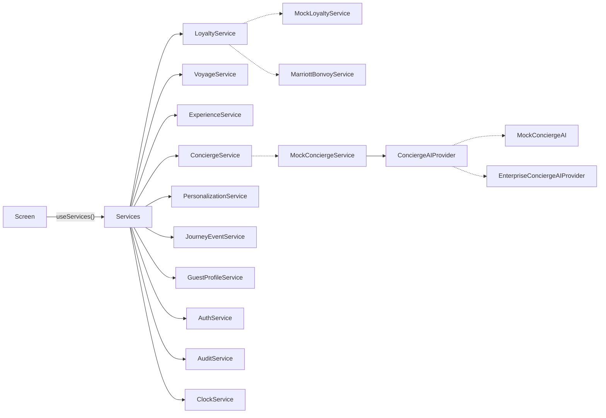

# 5 · Service Interfaces

The source is `src/services/contracts/index.ts`. Screens obtain services only through `useServices()`, and never import an implementation.

## Implementations and modes

`src/services/registry.ts` picks the implementations from `EXPO_PUBLIC_SERVICE_MODE`. Nothing else in the app knows which are in use.

| Contract | `mock` (default) | `supabase` | `enterprise` |
|---|---|---|---|
| AuthService | `MockAuthService` (pre-signed-in; any six-digit code) | `SupabaseAuthService`: e-mail one-time code, keychain session | mock |
| GuestProfileService | `RepositoryGuestProfileService` with `MockGuestRecordSource` + `LocalPreferencesRepository` | the same service with `SupabaseGuestRecordSource` + `SupabasePreferencesRepository` | mock |
| LoyaltyService | `MockLoyaltyService` | `SupabaseLoyaltyService` (Bonvoy projection) | `MarriottBonvoyService` (BFF) |
| VoyageService | `MockVoyageService` | `SupabaseVoyageService` | mock |
| ExperienceService | `MockExperienceService` | `SupabaseExperienceService` | mock |
| ScheduleService | `MockScheduleService` | `SupabaseScheduleService` | mock |
| ConciergeService | `MockConciergeService` + `MockConciergeAI` | `SupabaseConciergeService` (`concierge-respond` Edge Function, Realtime) | mock |
| PersonalizationService | `MockPersonalizationService` + rules engine (`rules-v1`) | `SupabasePersonalizationService` (`personalization-next-best` Edge Function, materialised recommendations) | mock |
| ServiceRecoveryService | `ComposedRecoveryService` + `MemoryRecoveryStore` (records with the shared handler; `?demo=disruption`) | `ComposedRecoveryService` + `SupabaseRecoveryNoticeStore` (crew: `SupabaseRecoveryOperations`) | mock |
| PostVoyageService | `ComposedPostVoyageService` + `MemoryPostVoyageStore` (`?demo=welcome-home`) | `ComposedPostVoyageService` + `SupabasePostVoyageStore` (`voyage_feedback`, `voyage_inspirations`) | mock |
| ContinuityService | `MockContinuityService` + `MockTravelDisruptionService` (the only flight-status source) | `SupabaseContinuityService` (`arrival_updates`) | mock |
| JourneyEventService | `MockJourneyEventService` | `SupabaseJourneyEventService` (alerts, notifications, Realtime) | mock |
| ClockService | pinned demo moment (`?now=`, `EXPO_PUBLIC_DEMO_NOW`) | device clock | device clock |

Rules shared by every implementation live in `src/services/shared/`, so behaviour doesn't depend on the backend:

* `journeyPhase`;
* the calendar merge (`buildCalendar`);
* recommendation merging (curated wins);
* the recognition line and privilege filtering;
* neutral default preferences.

The mock-only test controls (`?scenario=`, `?now=`) have no effect in `supabase` mode.

**Supabase specifics**

* Every read runs as the signed-in guest, so RLS decides what comes back. The guest ID in a call is a filter, not a permission.
* IDs are checked as UUIDs before use. This also stops them altering PostgREST filter strings.
* Database errors map to `ServiceError` codes. `42501` → `forbidden`; `PGRST116`/`P0002` → `not_found`; `23505`/`40001` → `conflict`; check violations → `validation`; network and 5xx → `unavailable` (retryable).
* Times are read from the `*_local` views, so they carry the port's offset as in the mocks.
* `sendMessage` posts only `{ conversationId, body, requestId }` to `concierge-respond`. `requestId` is a fresh UUID, so a retried call returns the stored reply. The server builds its own minimised context; the client's `GuestContext` is never sent. Replies carry a `classification` (`information` / `recommendation` / `transactional`). See [11 · Concierge AI](11-concierge-ai-architecture.md).
* Bookings are requests. Changes and cancellations go through database functions that allow nothing else.
* Known, intentional differences from the mock:
  * the guest record omits the date of birth;
  * the relationship omits the internal value segment;
  * the concierge greeting is generic;
  * `checkAvailability` returns real slots;
  * `linkMembership` and Bonvoy sign-in report `unavailable` until their server-side flows are configured.

`npm run test:supabase` runs these services against PostgreSQL + PostgREST and compares each read with the mock (see [docs/04](04-database-schema.md#testing)).



## Contracts at a glance

### LoyaltyService
```ts
getMembership(guestId): Promise<LoyaltyMembership | null>
getRelationship(guestId): Promise<GuestRelationship>
getPrivileges(guestId, voyageId?): Promise<GuestPrivilege[]>
getRecognition(guestId, voyageId?): Promise<LoyaltyRecognition>   // read model for Home/Profile
linkMembership(guestId, authorizationCode): Promise<LoyaltyMembership>
```
`MockLoyaltyService` serves it today. `MarriottBonvoyService` (in `src/services/remote/`) is the production client of the BFF `/loyalty/*` routes, which call Bonvoy server-side. **The UI does not change when Bonvoy is connected.**

### VoyageService
Covers reservations, the voyage, the yacht, the suite, the itinerary, embarkation and travel documents, plus `getOverview()` (a composite read model) and `getJourneyPhase()`.

### ExperienceService
Covers dining, spa, excursions, marina, entertainment, transfers and private experiences:
`listBookings`, `getNextBooking`, `getDaySchedule`, `listDaySchedules`, `listCatalogue`, `getExperience`, `listCollections`, `listDestinations`, `checkAvailability`, `requestBooking`, `requestChange`, `cancelBooking`.

### ConciergeService
```ts
openConversation(reservationId)                               // history + today's opening (prompts, suggested requests)
sendMessage(conversationId, body, context: GuestContext)      // AI-first reply, grounded in the guest's data
performAction(conversationId, action: ConciergeAction)        // the guest tapped an action card
escalateToHuman(EscalationRequest & { to?: EscalationTarget }) // Suite Ambassador, concierge team or medical
createServiceRequest(reservationId, input)
listServiceRequests(reservationId) / getServiceRequest(id)    // request status
subscribe(conversationId, listener)                           // a person joining / replying
```

**Replies carry structure, not just prose.** `ConciergeMessage.attachments` can hold:

* `schedule`: a day of the programme;
* `actions`: an action card about an experience, booking or request, with buttons;
* `confirmation`: the outcome of an action ("Confirmed", or "Requested" and being arranged), with a reference;
* `handoff`: who has been asked to join, and how soon;
* `privileges`: the guest's privileges for the voyage;
* `service-request`: a request and its status.

The UI renders these. It writes no answer text itself.

**Actions** (`ConciergeAction`) are offers the guest consents to by tapping:

* `change-booking`: move a booking to an available time;
* `request-experience`: book a slot, optionally answering a request that is awaiting the guest;
* `service-request`: anything a person arranges (a car, flowers);
* `escalate`: hand over to a person;
* `open`: in-app navigation, handled by the app (routes must start with `/`).

A guest can also confirm in words ("21:00, please"). The provider returns `perform`, and the service carries it out.

**Separation.** `ConciergeAIProvider.respond()` only decides. It returns `{ messages, confidence, shouldEscalate, escalateTo, escalationReason, perform }`. The orchestrating service acts: it books, records requests and hands over, through the same Voyage and Experience services the app uses. A table moved in Concierge is therefore moved on the Voyage and Home tabs too.

**Grounding (mock).** `MockConciergeAI` answers from a snapshot that `MockConciergeService` loads through the other services:

* itinerary, embarkation and flights;
* bookings, day programme, catalogue and availability;
* profile and preferences;
* recognition;
* requests;
* the personalised ranking with reasons, which is empty when personalisation is off.

The answer functions (`src/services/mock/concierge/answers.ts`) are pure, so `scripts/check-concierge.ts` pins them. "Today" and "tomorrow" are judged where the guest is: at home before and after the voyage, in port time aboard. For example, at 09:00 on 18 May, "What should I do tomorrow?" uses day 5 (Monte Carlo):

* the bookings that day, with the window table noted;
* free time, and unbooked experiences that fit around the bookings and the guest's preferences (private only ashore, preferred spa time, not too long), each with its personal reason;
* sunset and dress code.

Change a preference and the answer changes.

**People.** The guest can reach a person from the header ("Speak with a person"), by asking, or through a reply's card:

| Target | Who | When |
|---|---|---|
| `suite-ambassador` | The named Suite Ambassador (from the reservation) | The guest names them or the ambassador; occasion planning; private dinners; overdue requests ("Ask Elena to chase it") |
| `concierge-team` | Shoreside concierge before and after the voyage, Guest Services aboard | "Speak to a real person"; complaints; a second unclear request in a row |
| `medical` | The Medical Centre, urgent priority | Medical words. The emergency advice depends on where the guest is |

The first unclear request is not escalated automatically: the concierge offers a person instead of guessing. Every hand-off is also a service request, so it shows under Requests. The person who joins picks up the current topic.

**Supabase.** `performAction` uses RLS-checked writes:

* requests are inserted as `received`;
* booking changes go through `request_experience_booking_change`;
* bookings are inserted as requests.

It returns confirmations composed on the device, showing "Requested" or "Being arranged" until the crew confirm. `service_requests` now links `experience_id` and `booking_id` (migration `20261005000000_concierge_links.sql`, with RLS checks on both links).

### ExperienceService.listAvailability
`listAvailability(voyageId): Promise<ExperienceAvailability[]>` returns, per experience:

* a status: `available`, `limited`, `waitlist` or `unavailable`;
* dated slots with remaining places;
* an optional guest-facing note, such as "Four places left".

### PersonalizationService
```ts
getPersonalizedRecommendations(guestId, reservationId, { limit?, includeBooked? }): PersonalizedRecommendation[]
getRecommendations(guestId, surface, opts): Recommendation[]      // per surface, curated + engine
recordFeedback(guestId, recommendationId, signal)
```
`PersonalizedRecommendation` is the output of the deterministic, rules-based engine ([10 · Personalization](10-personalization-architecture.md#the-mvp-engine-rules-v1)):

| Field | Meaning |
|---|---|
| `recommendation` | What is suggested, e.g. "Dinner on a Private Terrace" |
| `category` | The experience category |
| `reason` | One guest-facing sentence. It never mentions scores, Bonvoy tiers or segments |
| `relevanceScore` | 0–1. **Internal:** ranking and thresholds only, never rendered |
| `voyageDate`, `dayNumber` | When it fits the voyage |
| `destination` | The port, or "Aboard Evrima in Monte Carlo" / "Aboard Evrima, at sea" |
| `action` | A `ConciergeAction` (request a slot, ask the concierge or Suite Ambassador, open the calendar) |
| `sourceSignals` | Which inputs drove it (`kind`, `detail`, `visibility`). Internal signals are stripped before the app |
| `rules`, `booked` | The rules that fired; whether it is already booked |

* **Mock.** `MockPersonalizationService` runs the engine on the device over the shared mock services, with the fixture history and value segment.
* **Supabase.** `SupabasePersonalizationService` calls the `personalization-next-best` Edge Function. It loads the inputs guests cannot read with the service role, runs the same engine, and returns guest-safe output.
* **Surfaces.** For Discover and Voyage, `getRecommendations` explains every experience with the engine (booked ones too) and merges in the curated picks. Home keeps its curated picks. Crew-audience opportunities are never returned to the guest app.

### ServiceRequestService
`submit`, `listActive`, `listHistory`, `get`, `close` (withdraw before work starts, or close once resolved) and `subscribe`. It returns `GuestServiceRequest` with:

* category (10), the five guest statuses, priority;
* guest and voyage, the assigned team and department, resolution notes;
* a timeline.

It shares one store with the concierge's requests. Implementations: `MockServiceRequestService` (shared `MockRequestStore`, optional crew simulation) and `SupabaseServiceRequestService`. See [12](12-occasions-and-service-requests.md).

### OccasionService
`listCelebrations`, `getPlan`, `approveStep`. Celebrations (birthday, anniversary, honeymoon, milestone voyage, Bonvoy milestone) are detected during the voyage and planned from playbooks.

`approveStep` is the only way a step becomes a booking request or a service request. It requires `approved: true`, and `acknowledgedCharge: true` for anything with a cost. `ComposedOccasionService` implements it over the other contracts in both modes. See [12](12-occasions-and-service-requests.md).

### NotificationService
`list` (the inbox), `upcoming`, `unreadCount`, `markRead`, `markAllRead`, `getSettings`, `updatePreferences` (urgent cannot be changed), `registerDevice`, `listDevices`, `unregisterDevice` and `subscribe`.

Notifications are derived by the shared engine from the guest's data and merged with what the server sent. They come in seven types: information, reminder, service update, reservation, itinerary change, urgent, recommendation. Preferences are stored in `communication.notifications`.

`ComposedNotificationService` implements it in both modes. It keeps read state and devices in a `NotificationStateStore` (memory or Supabase). The device side of push is `Services.push` (`PushRegistrar`). See [13](13-notifications.md).

### PostVoyageService
`getRecap` (null until the voyage is over), `saveFeedback` (a versioned draft, any part, any time) and `sendFeedback` (once; it raises a request when the guest asked to be contacted).

The recap holds the welcome, memories by day, destinations, favourites, a Bonvoy placeholder, the Suite Ambassador's note, recommendations and inspiration. The reflections hold five optional questions, and no ratings.

`ComposedPostVoyageService` implements it in both modes, with a `PostVoyageStore`. See [17](17-post-voyage.md).

### VoyageHistoryService
`listVoyages` (newest first) and `getVoyage` (not_found if not the guest's). Each entry has the yacht, dates, destinations, suite, experiences, dining highlights, saved preferences (kept or noted against today's preferences), memories and a photographs placeholder.

`ComposedVoyageHistoryService` implements it in both modes, with a `VoyageHistoryStore`. The same records feed the personalization engine's history. See [18](18-voyage-history.md).

### AnalyticsService and AnalyticsProvider
`AnalyticsService` has `track`, `screen`, `setConsent` and `flush`. It records ten declared product events, screened by an allow-list and a privacy filter. It waits for the guest's consent and never throws.

* `AnalyticsProvider.send(batch)` is the vendor seam: Noop, Console, Memory and FanOut today.
* `withAnalytics` taps the experience, requests, concierge and profile services.

See [19](19-analytics.md).

### EventService, EventHandler and TransferService
`EventService` is the internal event bus: twelve event types in one snake_case envelope. Its methods are `publish`, `register`, `get`, `list`, `runs` and `subscribe`.

* `EventHandler`s, one per service, react in registration order. They may `emit` follow-up events in the same chain.
* `TransferService.retime` moves a transfer with its operator; the mock operator confirms.
* The MVP implementation is `InMemoryEventService`. It is composed in the registry and is not part of the guest app's `Services`.

See [16](16-internal-events.md).

### ContinuityService and TravelDisruptionService
`ContinuityService` (`getArrivalUpdate`, `subscribe`): what the guest reads when travel to the yacht changes. Each step is done or requested, as its owner reported; "We've adjusted your arrival arrangements." appears only when the transfer and the embarkation team are done.

`TravelDisruptionService` (`getFlightStatus`, `subscribe`) is the flight-status source. **Only `MockTravelDisruptionService` exists**; a production adapter would run server-side and publish `flight.delayed`.

| Mode | Implementation |
|---|---|
| Mock | `MockContinuityService` runs the shared orchestrator with mock ports (`?demo=flight-delay`). |
| Supabase | `SupabaseContinuityService` reads `arrival_updates`. |

See [15](15-shoreside-continuity.md).

### ServiceRecoveryService
`listNotices`, `getNotice`, `acceptAlternative` (requires `approved: true`, and `acknowledgedCharge` for anything priced), `requestAssistance` and `subscribe`.

A disruption is recorded once, server-side. The guest's notice is planned afresh by the shared engine, so its alternatives are what is free now. It never carries severity, the crew brief or goodwill.

The crew's side is `ServiceRecoveryOperations` (`listRecords`, `listProposals`, `decideProposal`). It is not in the guest app's `Services`.

Goodwill is only ever *proposed* by approved, authorised rules, and decided by a person with the role the rule names. Financial goodwill is off in the MVP. See [14](14-service-recovery.md).

### GuestProfileService and preference persistence
```ts
getProfile(guestId)                       // guest record + latest saved preferences
getPreferences(guestId): VersionedPreferences   // { preferences, version, updatedAt, source }
updatePreferences(guestId, patch, { expectedVersion })   // ServiceError('conflict') if stale
```
`RepositoryGuestProfileService` composes two sources:

* a `GuestRecordSource` for identity, companions, occasions and default preferences (CRM; mock for now);
* a `PreferencesRepository` for what the guest edits.

The registry picks the repository, and the UI never sees which:

| Mode | Record source | Repository | Storage |
|---|---|---|---|
| `supabase` | `SupabaseGuestRecordSource` | `SupabasePreferencesRepository` | `public.guest_preferences`, RLS "own" policy, `version` column (migration `20261003000000`) |
| `mock`, `enterprise` | `MockGuestRecordSource` | `LocalPreferencesRepository` | AsyncStorage (device) or localStorage (web), behind `resilientStore` with a session-memory fallback |

Rules shared by both:

* A patch replaces whole groups.
* A saved group loads exactly as saved, so cleared fields stay cleared.
* Groups missing from older records come from the defaults.
* Every save is validated at the service boundary (temperature, note length, allergy names, quiet hours).
* In Supabase, a trigger audits which groups changed, never their values.

### ScheduleService
`getCalendar(reservationId): Promise<CalendarDay[]>` returns the party's chronological calendar. It merges:

* the voyage programme (yacht events, port times and suggestions);
* every booking (dining, spa, excursions, private experiences, transfers);
* flights, including travel days before and after the voyage.

`MockScheduleService` builds it from the fixtures. In production it's a BFF read model joining the shipboard PMS, shore ops and reservations.

### JourneyEventService
`listAlerts`, `acknowledge`, and `subscribe(reservationId, listener, types?)` for real-time continuity events.

### AuthService, GuestProfileService, AuditService, ClockService
These cover the session, the profile and preferences, advisory client audit, and an injected time source. Mocks pin "now" to a demo moment.

## Conventions

* **Domain types only.** Vendor data transfer objects (DTOs) are mapped in the BFF and never reach the device.
* **Errors.** `ServiceError(code, message, retryable)`, where `code` is one of `unauthenticated | forbidden | not_found | conflict | unavailable | validation | unknown`. Screens map codes to calm copy ("We couldn't reach the yacht just now").
* **No secrets in signatures.** Tokens are attached by the transport (`ApiClient`) from secure storage.
* **Idempotent writes.** Remote adapters send an `X-Request-Id`, and the BFF deduplicates on it.

## Replacing a mock: a checklist

1. Implement the contract: `src/services/remote/<Name>.ts` using `ApiClient` (enterprise BFF), or `src/services/supabase/` (Supabase).
2. Add the matching BFF route or Edge Function, which handles the vendor call, mapping, PII minimisation and audit.
3. Register the adapter in `compose()` in `registry.ts` for its mode.
4. Compare it with the mock on the shared dataset, as `scripts/supabase/integration.ts` does for Supabase.
5. No screen changes are needed.
