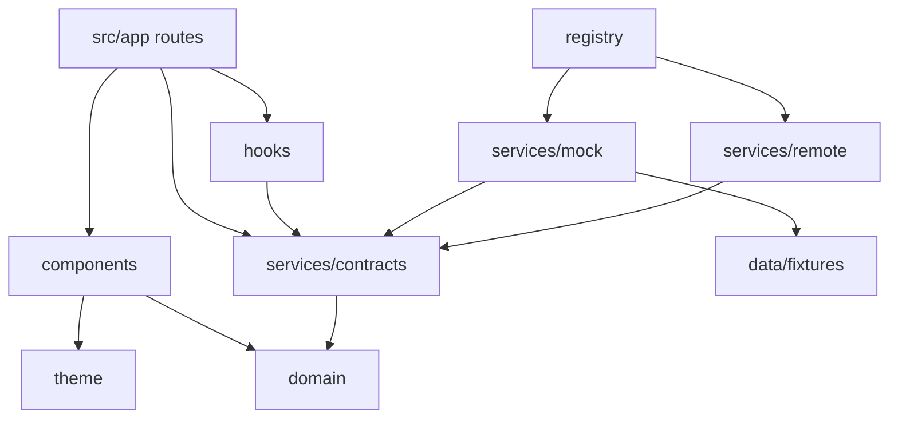

# 6 · Application Folder Structure

```
RCYC-Loyalty-App/
├── app.json                      Expo config (scheme, plugins, typed routes)
├── eslint.config.js              Expo lint rules + architecture boundaries
├── .env.example                  EXPO_PUBLIC_* only — never secrets
├── assets/                       Icons & splash
├── docs/                         Architecture (this folder)
├── src/
│   ├── app/                      Expo Router — every file is a route
│   │   ├── _layout.tsx           Root: fonts, SafeArea, ServiceProvider, JourneyProvider, root ErrorBoundary
│   │   ├── +not-found.tsx        Unknown routes / stale deep links
│   │   └── (tabs)/
│   │       ├── _layout.tsx       Five-tab navigator
│   │       ├── index.tsx         Home
│   │       ├── voyage.tsx        Voyage
│   │       ├── discover.tsx      Discover
│   │       ├── concierge.tsx     Concierge
│   │       └── profile.tsx       Profile
│   ├── components/               Design-system primitives (no data access)
│   │   ├── Typography.tsx        Text, Eyebrow, Title, Display, Caption
│   │   ├── Layout.tsx            Screen, PageHeader, Section, Card, DetailRow, Divider, states
│   │   ├── Media.tsx             MediaFrame, Hero, MediaTile
│   │   ├── Controls.tsx          Button, TextLink, SegmentedTabs, AlertNote
│   │   └── ErrorFallback.tsx     Route ErrorBoundary UI (export as `ErrorBoundary`)
│   ├── config/env.ts             Typed, statically-read EXPO_PUBLIC_* config + validateEnv()
│   ├── core/
│   │   ├── errors/               AppError taxonomy, toAppError, guestMessage, global handlers
│   │   └── logging/              Logger interface, createLogger, Console/Memory/Remote sinks
│   ├── data/fixtures/            Fictional guest, voyage & experience data (mock only)
│   ├── domain/                   Pure TypeScript domain model — no React, no I/O
│   ├── hooks/
│   │   ├── useAsync.ts           Minimal data hook (swappable for TanStack Query)
│   │   └── useJourney.tsx        Session + reservation + journey phase context
│   ├── security/
│   │   ├── secureStorage.ts      Keychain/Keystore token storage
│   │   ├── authorization.ts      Presentation-only permission checks
│   │   └── pii.ts                Masking / redaction for logs & telemetry
│   ├── services/
│   │   ├── contracts/            ★ Service interfaces — the presentation boundary
│   │   ├── mock/                 Mock implementations (MVP)
│   │   ├── remote/               BFF client + enterprise adapters (MarriottBonvoyService)
│   │   ├── registry.ts           Composition root: validate env → mode → implementations
│   │   ├── instrument.ts         Logs every service call's failures & slow responses
│   │   └── ServiceProvider.tsx   React context + useServices()
│   ├── theme/tokens.ts           Colour, type, spacing, radii, motion, elevation
│   └── utils/format.ts           Port-local time & date formatting
└── supabase/
    ├── config.toml               Auth hardening (15-min JWT, rotation, no self-signup)
    ├── migrations/               Schema + RLS + storage policies
    ├── functions/
    │   ├── _shared/auth.ts       JWT verification, roles, audit, error handling
    │   ├── concierge-respond/    AI orchestration + escalation
    │   ├── journey-events/       HMAC webhook ingest → alert projection
    │   └── personalization-next-best/  Next-best-experience scoring
    └── tests/                    Local stubs + RLS smoke test
```

## Dependency rules



* `src/app` and `src/components` **must not** import from `services/mock`, `services/remote` or `data/fixtures`.
* `src/domain` has no dependencies.
* Only `registry.ts` knows which implementations exist.

`eslint.config.js` enforces these rules (`no-restricted-imports`), so `npm run lint` fails if a screen imports a mock or a fixture.

## Error handling

| Layer | Mechanism |
|---|---|
| Services | Throw `ServiceError` (extends `AppError`) with a stable `code`. `instrument.ts` normalises any other throw to `AppError` and logs it. |
| Data hooks | `useAsync` returns `error: AppError` and reports it. Screens render `<ErrorState error={error} onRetry={reload} />`. |
| Render | Each tab exports `ErrorBoundary`, so a crash is contained to that tab. The root layout catches the rest, including config and session failures. |
| Escaped | `installGlobalErrorHandlers()` hooks React Native's `ErrorUtils` and web `unhandledrejection`. |
| Copy | `guestMessage(error)` maps each code to calm, on-brand text. Raw messages go only to the logger. |

## Logging

`logger.child('scope')` returns a `Logger`. Each record is PII-scrubbed and fanned out to the configured sinks:

* `ConsoleSink` (development only).
* `MemorySink`, a 200-record ring buffer for diagnostics and tests.
* `RemoteSink`, ready to batch warnings and errors to the BFF telemetry endpoint.

The level comes from `EXPO_PUBLIC_LOG_LEVEL`, defaulting to `debug` in development and `warn` in production.
