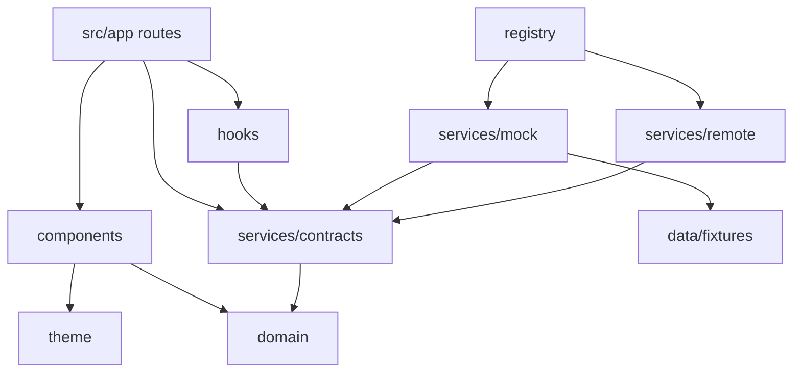

# 6 · Application Folder Structure

```
RCYC-Loyalty-App/
├── app.json                      Expo config (scheme, plugins, typed routes)
├── .env.example                  EXPO_PUBLIC_* only — never secrets
├── assets/                       Icons & splash
├── docs/                         Architecture (this folder)
├── src/
│   ├── app/                      Expo Router — every file is a route
│   │   ├── _layout.tsx           Root: fonts, SafeArea, ServiceProvider, JourneyProvider
│   │   └── (tabs)/
│   │       ├── _layout.tsx       Five-tab navigator
│   │       ├── index.tsx         Home
│   │       ├── voyage.tsx        Voyage
│   │       ├── discover.tsx      Discover
│   │       ├── concierge.tsx     Concierge
│   │       └── profile.tsx       Profile
│   ├── components/               Design-system primitives (no data access)
│   │   ├── Typography.tsx        Text, Eyebrow, Title, Display, Caption
│   │   ├── Layout.tsx            Screen, PageHeader, Section, Card, DetailRow, Divider, states
│   │   ├── Media.tsx             MediaFrame, Hero, MediaTile
│   │   └── Controls.tsx          Button, TextLink, SegmentedTabs, AlertNote
│   ├── config/env.ts             Typed EXPO_PUBLIC_* config
│   ├── data/fixtures/            Fictional guest, voyage & experience data (mock only)
│   ├── domain/                   Pure TypeScript domain model — no React, no I/O
│   ├── hooks/
│   │   ├── useAsync.ts           Minimal data hook (swappable for TanStack Query)
│   │   └── useJourney.tsx        Session + reservation + journey phase context
│   ├── security/
│   │   ├── secureStorage.ts      Keychain/Keystore token storage
│   │   ├── authorization.ts      Presentation-only permission checks
│   │   └── pii.ts                Masking / redaction for logs & telemetry
│   ├── services/
│   │   ├── contracts/            ★ Service interfaces — the presentation boundary
│   │   ├── mock/                 Mock implementations (MVP)
│   │   ├── remote/               BFF client + enterprise adapters (MarriottBonvoyService)
│   │   ├── registry.ts           Composition root: mode → implementations
│   │   └── ServiceProvider.tsx   React context + useServices()
│   ├── theme/tokens.ts           Colour, type, spacing, radii, motion, elevation
│   └── utils/format.ts           Port-local time & date formatting
└── supabase/
    ├── config.toml               Auth hardening (15-min JWT, rotation, no self-signup)
    ├── migrations/               Schema + RLS + storage policies
    ├── functions/
    │   ├── _shared/auth.ts       JWT verification, roles, audit, error handling
    │   ├── concierge-respond/    AI orchestration + escalation
    │   ├── journey-events/       HMAC webhook ingest → alert projection
    │   └── personalization-next-best/  Next-best-experience scoring
    └── tests/                    Local stubs + RLS smoke test
```

## Dependency rules



* `src/app` and `src/components` **must not** import from `services/mock`, `services/remote` or `data/fixtures`.
* `src/domain` has no dependencies.
* Only `registry.ts` knows which implementations exist.

These rules can be enforced later with `eslint-plugin-boundaries` or `dependency-cruiser` in CI.
