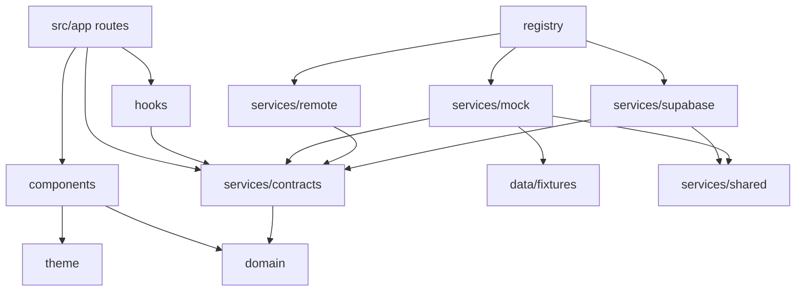

# 6 · Application Folder Structure

```
RCYC-Loyalty-App/
├── app.json                      Expo config (scheme, plugins, typed routes)
├── eslint.config.js              Expo lint rules + architecture boundaries
├── .env.example                  EXPO_PUBLIC_* only — never secrets
├── assets/                       Icons & splash
├── docs/                         Architecture (this folder)
├── src/
│   ├── app/                      Expo Router — every file is a route
│   │   ├── _layout.tsx           Root: fonts, SafeArea, ServiceProvider, JourneyProvider, root ErrorBoundary
│   │   ├── +not-found.tsx        Unknown routes / stale deep links
│   │   └── (tabs)/
│   │       ├── _layout.tsx       Five-tab navigator
│   │       ├── index.tsx         Home
│   │       ├── voyage.tsx        Voyage
│   │       ├── discover.tsx      Discover
│   │       ├── concierge.tsx     Concierge
│   │       └── profile.tsx       Profile
│   ├── components/               Design-system primitives (no data access)
│   │   ├── Typography.tsx        Text, Eyebrow, Title, Display, Caption
│   │   ├── Layout.tsx            Screen, PageHeader, Section, Card, DetailRow, Divider, states
│   │   ├── Media.tsx             MediaFrame, Hero, MediaTile
│   │   ├── Controls.tsx          Button, TextLink, SegmentedTabs, AlertNote
│   │   ├── ErrorFallback.tsx     Route ErrorBoundary UI (export as `ErrorBoundary`)
│   │   ├── Feedback.tsx          StatusLine, EmptyNote, InlineError, FactRow, SkeletonBlock
│   │   └── Form.tsx              ChoiceGroup, MultiChoiceGroup, ToggleRow, TextField, Stepper
│   ├── config/env.ts             Typed, statically-read EXPO_PUBLIC_* config + validateEnv()
│   ├── core/
│   │   ├── errors/               AppError taxonomy, toAppError, guestMessage, global handlers
│   │   └── logging/              Logger interface, createLogger, Console/Memory/Remote sinks
│   ├── data/fixtures/            Fictional guest, voyage & experience data (mock only)
│   ├── features/
│   │   ├── auth/                 Sign-in: useSignIn (e-mail code state machine) + SignInScreen
│   │   ├── notifications/        Inbox (/notifications) and settings (/notifications/settings): notificationsModel, useNotifications
│   │   ├── celebrations/         A celebration during the voyage (/celebration/[key]): message, ideas, approval panel
│   │   ├── continuity/           Arrival updates (/arrival) and the Home card: arrivalModel, useArrival
│   │   ├── recovery/             A disruption, told calmly (/recovery/[id]): reason, comparable alternatives, approval, Ask Elena; Home card
│   │   ├── requests/             Service requests (/requests, /requests/new, /requests/[id]): requestsModel, useRequests, screens
│   │   ├── concierge/            Concierge (?view=requests)
│   │   │   ├── conciergeModel.ts Thread blocks, action cards, confirmations, hand-offs, request status, guest context (scripts/check-concierge.ts)
│   │   │   ├── useConcierge.ts   Service access: send, perform actions, escalate, live updates
│   │   │   ├── ConciergeScreen.tsx
│   │   │   └── components/       Thread (messages + cards), Chrome (header, people panel, quick replies, composer, requests list)
│   │   └── home/                 Home dashboard feature
│   │       ├── homeModel.ts      Pure view model: journey-aware decisions (tested by scripts/check-home.ts)
│   │       ├── useHomeDashboard.ts  The only service access for Home; per-section failure isolation
│   │       ├── HomeScreen.tsx    Composition and reading order
│   │       └── components/       HomeHero, HomeSections, HomeSkeleton (presentational)
│   │   ├── voyage/               Voyage area (9 sections, ?section= deep links)
│   │   │   ├── voyageModel.ts    Pure view model for every section (tested by scripts/check-voyage.ts)
│   │   │   ├── useVoyageArea.ts  Service access with per-source isolation
│   │   │   ├── VoyageScreen.tsx  Section tabs bound to the URL
│   │   │   └── components/       Overview, Itinerary/PortCard, Suite, Embarkation, Calendar, Category, Documents
│   │   ├── discover/             Curated marketplace (?category= deep links)
│   │   │   ├── discoverModel.ts  Cards, categories, filter options, applyDiscoverFilters() (scripts/check-discover.ts)
│   │   │   ├── useDiscover.ts    Service access with per-source isolation
│   │   │   ├── DiscoverScreen.tsx
│   │   │   └── components/       ExperienceCard, RecommendedRail, RefineBar, FilterPanel, ExperienceResults, DestinationList
│   │   ├── profile/              Profile (8 sections, ?section= deep links), editable preferences
│   │   │   ├── preferenceSchema.ts  Field schema per group: read / write / summary / validate (scripts/check-profile.ts)
│   │   │   ├── profileModel.ts   View model for every section
│   │   │   ├── useProfileArea.ts Load, save with expectedVersion, data requests
│   │   │   └── components/       ProfileSections, PreferenceEditor (generic, schema-driven)
│   │   └── shared/status.ts      Settled<T>, settle(), Tone, bookingStatus()
│   ├── domain/                   Pure TypeScript domain model — no React, no I/O
│   ├── hooks/
│   │   ├── useAsync.ts           Minimal data hook (swappable for TanStack Query)
│   │   └── useJourney.tsx        Session + reservation + journey phase context
│   ├── security/
│   │   ├── secureStorage.ts      Keychain/Keystore token storage
│   │   ├── chunkedStorage.ts     Splits large sessions across keychain entries
│   │   ├── authorization.ts      Presentation-only permission checks
│   │   └── pii.ts                Masking / redaction for logs & telemetry
│   ├── services/
│   │   ├── contracts/            ★ Service interfaces — the presentation boundary
│   │   ├── mock/                 Mock implementations (MVP)
│   │   │   └── concierge/        Mock concierge brain: snapshot (grounding + time rules), language, answers, confirmations
│   │   ├── remote/               BFF client + adapters (MarriottBonvoyService, SupabasePreferencesRepository, supabaseClient)
│   │   ├── supabase/             Every contract on Supabase: rows.ts (row types + mappers), support.ts (errors, checks), one service per context
│   │   ├── shared/               Pure rules used by every implementation: journeyPhase, calendar, recommendations, recognition, default preferences
│   │   ├── repositories/         PreferencesRepository (+ Local), KeyValueStore (+ AsyncStorage, memory, resilient)
│   │   ├── profile/              RepositoryGuestProfileService: guest record source + preferences repository
│   │   ├── personalization/      buildInput: domain objects → rules-engine inputs
│   │   ├── notifications/        buildNotifyInput, ComposedNotificationService, NotificationStateStore (memory)
│   │   ├── push/                 PushRegistrar (device side of push; Expo adapter designed in docs/13), routeFromPush
│   │   ├── occasions/            Celebration detectors, playbooks and planner; ComposedOccasionService (approval)
│   │   ├── events/               InMemoryEventService, the delayed-flight wiring, and one handler per service (handlers/)
│   │   ├── continuity/           buildArrivalContext (the continuity rules' context from the contracts)
│   │   ├── recovery/             buildRecoveryContext, ComposedRecoveryService (approval), RecoveryNoticeStore + MemoryRecoveryStore (mock server, crew operations)
│   │   ├── registry.ts           Composition root: validate env → mode → implementations
│   │   ├── instrument.ts         Logs every service call's failures & slow responses
│   │   └── ServiceProvider.tsx   React context + useServices()
│   ├── theme/tokens.ts           Colour, type, spacing, radii, motion, elevation
│   └── utils/format.ts           Port-local time & date formatting
└── supabase/
    ├── config.toml               Auth hardening (15-min JWT, rotation, no self-signup)
    ├── migrations/               Schema + RLS + storage policies
    ├── functions/
    │   ├── _shared/auth.ts       JWT verification, roles, audit, error handling
    │   ├── _shared/concierge/    Concierge AI pipeline (runtime-agnostic; docs/11)
    │   ├── concierge-respond/    Endpoint: JWT → clients + provider → pipeline
    │   ├── journey-events/       HMAC webhook ingest → continuity (flight.delayed) · service recovery (disruptions) → alert projection
    │   ├── _shared/personalization/  Rules engine rules-v1 (shared with the app's mock mode)
    │   ├── _shared/notifications/    Notification engine, dispatcher, Expo/dry-run senders (shared with the app)
    │   ├── _shared/requests/         Request status, timeline and routing rules (shared with the app)
    │   ├── _shared/continuity/       Flight-delay rules, orchestrator and ports (shared with the app's mock pipeline)
    │   ├── _shared/recovery/         Service recovery rules, goodwill rules and proposals, recording handler (shared with the app)
    │   ├── service-recovery-scan/    Scheduled detection of disruptions in the guests' own data (cron secret)
    │   ├── notifications-dispatch/   Scheduled push dispatch (cron secret; dry-run until switched on)
    │   └── personalization-next-best/  Endpoint: authorise → load inputs → engine → guest-safe output
    └── tests/                    Local stubs + SQL smoke tests (RLS, preferences, integration)
scripts/
├── check-*.ts                    View-model, fixture, concierge-server and Supabase checks (npm run verify)
├── generate-seed.ts              Writes supabase/seed.sql (npm run seed:generate)
└── supabase/                     Seed row builders, end-to-end runner (npm run test:supabase)
```

## Dependency rules



* `src/app`, `src/features`, `src/components` and `src/hooks` **must not** import from `services/mock`, `services/remote`, `services/supabase`, `@supabase/*` or `data/fixtures`.
* `services/remote`, `services/supabase` and `services/shared` **must not** import fixtures or mocks.
* A feature follows the same split as Home: a hook for data access, a pure view model for decisions, and presentational components.
* `src/domain` has no dependencies.
* Only `registry.ts` knows which implementations exist.

`eslint.config.js` enforces these rules (`no-restricted-imports`), so `npm run lint` fails if a screen imports a mock or a fixture.

## Error handling

| Layer | Mechanism |
|---|---|
| Services | Throw `ServiceError` (extends `AppError`) with a stable `code`. `instrument.ts` normalises any other throw to `AppError` and logs it. |
| Data hooks | `useAsync` returns `error: AppError` and reports it. Screens render `<ErrorState error={error} onRetry={reload} />`. |
| Render | Each tab exports `ErrorBoundary`, so a crash is contained to that tab. The root layout catches the rest, including config and session failures. |
| Escaped | `installGlobalErrorHandlers()` hooks React Native's `ErrorUtils` and web `unhandledrejection`. |
| Copy | `guestMessage(error)` maps each code to calm, on-brand text. Raw messages go only to the logger. |

## Logging

`logger.child('scope')` returns a `Logger`. Each record is PII-scrubbed and fanned out to the configured sinks:

* `ConsoleSink` (development only).
* `MemorySink`, a 200-record ring buffer for diagnostics and tests.
* `RemoteSink`, ready to batch warnings and errors to the BFF telemetry endpoint.

The level comes from `EXPO_PUBLIC_LOG_LEVEL`, defaulting to `debug` in development and `warn` in production.
