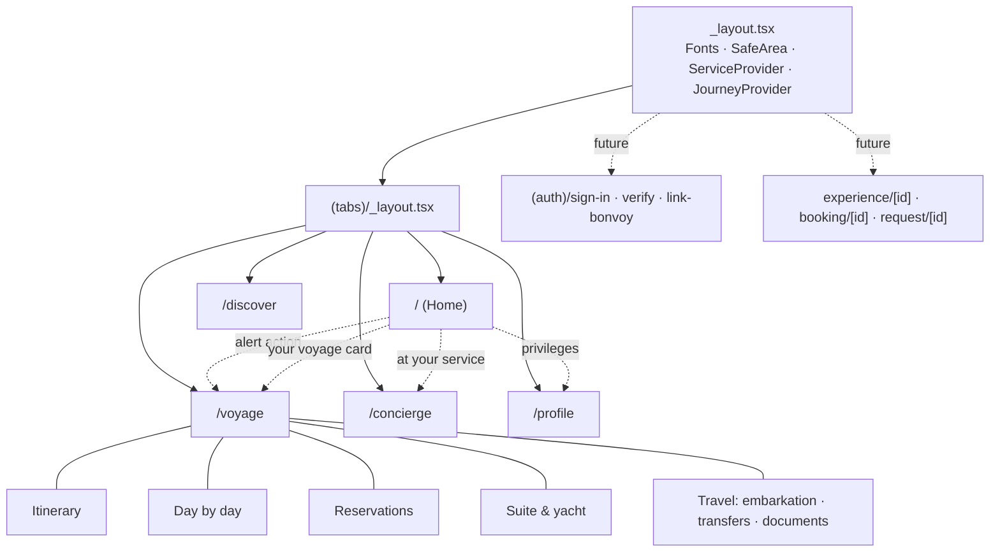

# 8 · Navigation Model

The app is built on Expo Router (file-based) with typed routes enabled.

## Tabs

| Tab | Question it answers | Primary content |
|---|---|---|
| **Home** | "What matters to me right now?" | Greeting, recognition, alerts, voyage and embarkation, next item, reservations, recommendations, concierge access |
| **Voyage** | "Tell me everything about my voyage." | Itinerary, daily schedule, restaurant, spa and shore reservations, marina and events, suite and yacht, embarkation, transfers, documents |
| **Discover** | "What could I do?" | Destinations, curated collections, personalised picks; filters for private, culinary, wine, spa, marina, evenings, shopping, culture and transport |
| **Concierge** | "Can someone take care of this?" | AI conversation, suggested questions, a named Ambassador hand-off, request status strip |
| **Profile** | "Do they know me?" | Bonvoy identity, relationship, privileges, voyages, personal details, companions, occasions, preferences, communication |

## Contextual navigation

* **The journey phase drives emphasis.** `useJourney().phase` lets Home and Voyage reorder content: embarkation details before sailing, the day's programme at sea, memories after the voyage.
* **Alerts deep-link** through `JourneyAlert.action.route`, so the BFF decides where a guest should land.
* **Planned deep links** (`rcycguest://`): `rcycguest://voyage`, `rcycguest://concierge`, and `rcycguest://experience/<id>` for push notifications and e-mail.
* Within a tab, the guest moves between sections with in-page `SegmentedTabs`, which avoids deep stacks. Detail views will open as modal sheets so the tab context is kept.

## Planned stacks (next iterations)

| Route | Presentation |
|---|---|
| `(auth)/sign-in`, `(auth)/verify`, `(auth)/link-bonvoy` | Full-screen, before the tabs; guarded in the root layout |
| `experience/[id]` | Modal sheet: imagery, details, availability, request |
| `booking/[id]` | Modal sheet: change or cancel |
| `request/[id]` | Push: service request timeline |
| `documents/[id]` | Modal sheet: secure upload to Storage |
