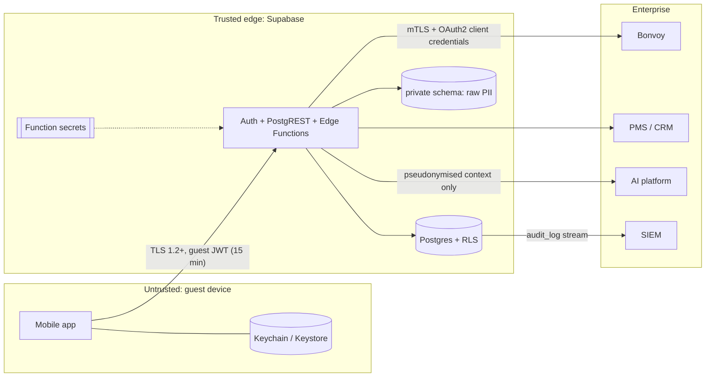

# 9 · Security Architecture

## Trust boundaries

## Controls

| Requirement | Implementation |
|---|---|
| **Strong authentication** | Supabase Auth with passwordless e-mail OTP (implemented: `SupabaseAuthService`) and **Marriott Bonvoy OIDC federation** (Authorization Code + PKCE; reports `unavailable` until the provider is configured). TOTP MFA is enrolled for crew, and step-up MFA protects sensitive guest actions (document upload, payment folio). Self-signup is disabled and the app requests codes with `shouldCreateUser: false`. Guests are invited from reservations; a trigger links a **confirmed** account to the single unlinked guest with that e-mail and grants the role (refusals audited). Requesting a code looks identical for known and unknown addresses (no account enumeration). An account with no guest record is signed out. Access tokens last 15 minutes; refresh tokens rotate and reuse is detected (`supabase/config.toml`). |
| **Role-based authorization** | `app_role` enum: `guest`, `travel_companion`, `suite_ambassador`, `concierge_agent`, `shore_ops`, `admin`. Crew roles are scoped to a yacht in `user_roles.yacht_id`. **RLS on every table** applies the "party or crew" rule. Edge Functions re-check roles (`requireCaller(req, allowed)`). Client checks (`src/security/authorization.ts`) only control what is shown. |
| **Secure token storage** | `expo-secure-store` with `WHEN_UNLOCKED_THIS_DEVICE_ONLY` (Keychain on iOS, Keystore on Android). Supabase sessions larger than one keychain entry are split across entries (`chunkedStorage.ts`); a missing part reads as signed out. Tokens never go to AsyncStorage or localStorage, and are never logged. The web preview uses memory only, so a reload signs out. Sign-out revokes the refresh token, and falls back to clearing the device if the network call fails. |
| **PII protection** | *Minimise:* the API returns masked values (`emailMasked`, `memberNumberMasked`). *Segregate:* raw PII lives in `private.guest_pii`, unreachable via PostgREST. *Pseudonymise:* the AI receives a salted-hash `guestRef`, never names plus identifiers. *Redact:* `pii.ts` scrubs logs and telemetry. *Special-category data:* dietary and medical records are flagged, and their access is audited. Travel documents sit in a private Storage bucket scoped to `<guest_id>/`. |
| **AI concierge** | The model is reached only from `concierge-respond`, with `ANTHROPIC_API_KEY` held as a function secret. The pipeline does the following ([11](11-concierge-ai-architecture.md)): • validates and authorizes every request from the JWT, and rate-limits and deduplicates it; • reads context under the guest's RLS; • redacts typed PII and sends only topic-relevant slices, with handles instead of IDs; • enforces structured output and checks grounding; • never lets the model claim or perform a change: only an offered action the guest accepts runs, through the booking services, and the confirmation text comes from the service result; • routes emergencies and health topics to people; • audits decisions without message text. |
| **Service recovery and goodwill** | Recorded recoveries (with the internal reason and the guest's own words) and goodwill proposals are crew-only, by RLS. Guests read only the guest-safe notice (a database check refuses internal reasons, quotes and guest ids) and answer through an RPC that ties any booking or request to their reservation. Goodwill is never applied automatically. Proposals come only from approved, authorised, effective rules. A decision needs the role the rule names (financial: an admin, with the policy switched on, off in the MVP), re-checks the rule and its limit, and is audited. Audit records kinds and counts, never the guest's words or the reason. |
| **Push notifications** | Expo push tokens are registered only through `register_push_device()` and are never readable back by the app (column grants); other guests and crew see none. The dispatcher runs with the service role behind a cron secret; payloads carry only lock-screen-safe text and an internal route (validated by a database check and `safeRoute`); dead tokens are disabled. Urgent notifications cannot be switched off. |
| **API abstraction** | The device calls only the BFF. Service contracts hide vendors. Vendor DTOs are mapped server-side. |
| **Audit logging** | `audit_log` is append-only (a trigger blocks UPDATE and DELETE). Edge Functions write it with the actor, roles, action, resource, outcome, request ID and a hashed IP. **Database triggers** write it for every change to guest-writable tables (bookings, service requests, conversations, companions, occasions, alerts, notifications) and for account linking. They record the columns changed, never the values. Every domain table carries `created_at/updated_at/created_by/updated_by`, stamped server-side from `auth.uid()`. It is streamed to the SIEM. A client `AuditService` exists for UX analytics only and is not authoritative. |
| **Environment-based secrets** | Only `EXPO_PUBLIC_*` values (the URL and the anon key, which RLS protects) are bundled. Service-role, Bonvoy, AI and HMAC secrets live in **Edge Function secrets** or the enterprise vault. `.env*` files are git-ignored, and `.env.example` documents the rule. |
| **No credentials in the app** | The app **refuses to start, in any mode,** if `EXPO_PUBLIC_SUPABASE_ANON_KEY` holds a service-role JWT or an `sb_secret_` key (`validateEnv`). Supabase URLs must be https (http only to localhost in development). `npm run check:supabase` fails if app code references a service-role key, reads a non-`EXPO_PUBLIC_` variable, or creates a Supabase client from anything but the anon key. Planned: CI secret scanning (gitleaks) and EAS build-time checks. |
| **Least privilege in Postgres** | `anon` has no access to `public` tables, views or functions. Client roles cannot create objects. Guests cannot write reference data, loyalty projections, the programme, roles or the audit log, even through a policy. Every view is `security_invoker`. Every `SECURITY DEFINER` function pins `search_path`. Writes the app needs beyond inserts go through narrow functions (`cancel_experience_booking`, `request_experience_booking_change`). The migration fails if a table lacks RLS or a view is not `security_invoker`. |
| **Webhook integrity** | `journey-events` verifies an HMAC-SHA256 signature over `timestamp.body`, with a five-minute replay window, a timing-safe comparison and an idempotent `dedupe_key`. |
| **Transport** | TLS everywhere. Certificate pinning for the BFF domain is planned through a config plugin for production builds. |
| **Device posture** | Planned for production: jailbreak/root detection, a privacy screen on app-switch, `FLAG_SECURE` on document views, and biometric re-auth before showing documents. |

## Threats considered (STRIDE summary)

| Threat | Mitigation |
|---|---|
| A guest enumerates other reservations | RLS `on_reservation()`. IDs are UUIDs. Verified by `10_rls_smoke.sql`, `30_integration_smoke.sql` and, through PostgREST, by `npm run test:supabase` (as a second guest and as anon). |
| Crew access beyond their yacht | `crew_for_reservation()` scopes by `yacht_id`. |
| A tampered client writes AI or crew messages | RLS lets guests insert only `author = 'guest'` with their own `auth.uid()`. |
| A guest rewrites booking status | Guests can insert only with `status = 'received'`, on their own reservation, for an active experience on that voyage, without provenance. Direct updates are crew-only; guests can only cancel or request a change through functions. |
| A guest self-assigns or escalates a request | `service_requests` inserts must be `received` and unassigned, with no promised update time and a conversation that is the guest's own. |
| A guest rewrites a notification or alert | Column grants allow `read_at` and `acknowledged_at` only. Deep links and alert actions must be in-app routes (check constraints, and again when mapping). |
| A guest scores another guest (IDOR) | `personalization-next-best` checks, through the caller's RLS scope, that the guest is on the reservation and is the caller (crew excepted) before any service-role read. |
| Filter injection through IDs | Services check IDs as UUIDs before building PostgREST `or=` or Realtime filters. |
| Account takeover by e-mail | Linking requires a confirmed e-mail, a single matching guest and an unlinked record. A second account with the same address is refused and audited. |
| Replayed or forged partner events | HMAC, timestamp window, dedupe key. |
| Prompt injection exfiltrates PII | The AI holds a minimised, pseudonymous context. Tools run through the BFF with the guest's own RLS scope, so the model can't reach beyond the guest's data. |
| Audit tampering | Append-only trigger. Admin-only reads. SIEM copy. |
| A leaked anon key | Without a valid user JWT, `anon` has no grants in `public` at all, and RLS would return nothing anyway. |

## Compliance alignment

The design is aligned with GDPR and UK GDPR (minimisation, purpose limitation, data-subject rights through CRM), PCI DSS (no card data in the app or Supabase; payments go through a tokenised PSP), and Marriott partner data-handling requirements. Each of these still needs formal review.
