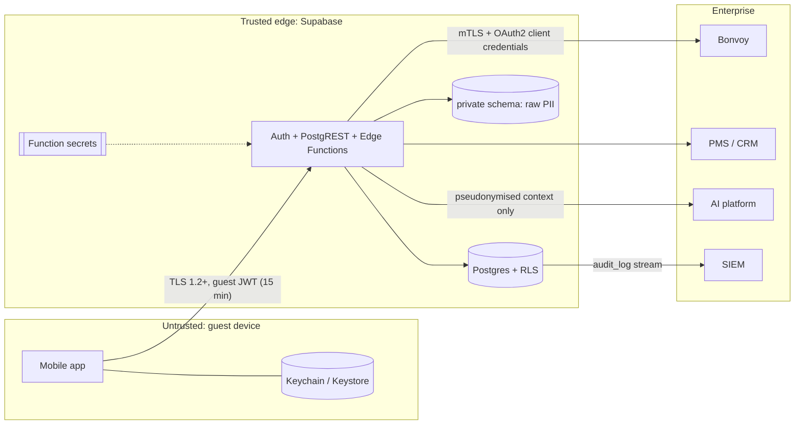

# 9 · Security Architecture

## Trust boundaries

## Controls

| Requirement | Implementation |
|---|---|
| **Strong authentication** | Supabase Auth with passwordless e-mail OTP and **Marriott Bonvoy OIDC federation** (Authorization Code + PKCE). TOTP MFA is enrolled for crew, and step-up MFA protects sensitive guest actions (document upload, payment folio). Self-signup is disabled: guests are provisioned from reservations. Access tokens last 15 minutes; refresh tokens rotate and reuse is detected (`supabase/config.toml`). |
| **Role-based authorization** | `app_role` enum: `guest`, `travel_companion`, `suite_ambassador`, `concierge_agent`, `shore_ops`, `admin`. Crew roles are scoped to a yacht in `user_roles.yacht_id`. **RLS on every table** applies the "party or crew" rule. Edge Functions re-check roles (`requireCaller(req, allowed)`). Client checks (`src/security/authorization.ts`) only control what is shown. |
| **Secure token storage** | `expo-secure-store` with `WHEN_UNLOCKED_THIS_DEVICE_ONLY` (Keychain on iOS, Keystore on Android). Tokens never go to AsyncStorage or localStorage, and are never logged. The web preview uses memory only. |
| **PII protection** | *Minimise:* the API returns masked values (`emailMasked`, `memberNumberMasked`). *Segregate:* raw PII lives in `private.guest_pii`, unreachable via PostgREST. *Pseudonymise:* the AI receives a salted-hash `guestRef`, never names plus identifiers. *Redact:* `pii.ts` scrubs logs and telemetry. *Special-category data:* dietary and medical records are flagged, and their access is audited. Travel documents sit in a private Storage bucket scoped to `<guest_id>/`. |
| **API abstraction** | The device calls only the BFF. Service contracts hide vendors. Vendor DTOs are mapped server-side. |
| **Audit logging** | `audit_log` is append-only (a trigger blocks UPDATE and DELETE) and is written by Edge Functions with the actor, roles, action, resource, outcome, request ID and a hashed IP. It is streamed to the SIEM. A client `AuditService` exists for UX analytics only and is not authoritative. |
| **Environment-based secrets** | Only `EXPO_PUBLIC_*` values (the URL and the anon key, which RLS protects) are bundled. Service-role, Bonvoy, AI and HMAC secrets live in **Edge Function secrets** or the enterprise vault. `.env*` files are git-ignored, and `.env.example` documents the rule. |
| **No credentials in the app** | Enforced by the design above, plus CI secret scanning (gitleaks) and EAS build-time checks. |
| **Webhook integrity** | `journey-events` verifies an HMAC-SHA256 signature over `timestamp.body`, with a five-minute replay window, a timing-safe comparison and an idempotent `dedupe_key`. |
| **Transport** | TLS everywhere. Certificate pinning for the BFF domain is planned through a config plugin for production builds. |
| **Device posture** | Planned for production: jailbreak/root detection, a privacy screen on app-switch, `FLAG_SECURE` on document views, and biometric re-auth before showing documents. |

## Threats considered (STRIDE summary)

| Threat | Mitigation |
|---|---|
| A guest enumerates other reservations | RLS `on_reservation()`. IDs are UUIDs. Verified by `10_rls_smoke.sql`. |
| Crew access beyond their yacht | `crew_for_reservation()` scopes by `yacht_id`. |
| A tampered client writes AI or crew messages | RLS lets guests insert only `author = 'guest'` with their own `auth.uid()`. |
| A guest rewrites booking status | Guests can insert only with `status = 'received'`. Updates are crew-only. |
| Replayed or forged partner events | HMAC, timestamp window, dedupe key. |
| Prompt injection exfiltrates PII | The AI holds a minimised, pseudonymous context. Tools run through the BFF with the guest's own RLS scope, so the model can't reach beyond the guest's data. |
| Audit tampering | Append-only trigger. Admin-only reads. SIEM copy. |
| A leaked anon key | Without a valid user JWT, RLS returns nothing. |

## Compliance alignment

The design is aligned with GDPR and UK GDPR (minimisation, purpose limitation, data-subject rights through CRM), PCI DSS (no card data in the app or Supabase; payments go through a tokenised PSP), and Marriott partner data-handling requirements. Each of these still needs formal review.
