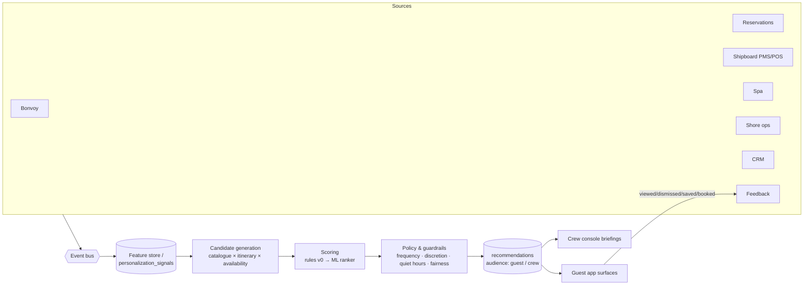

# 10 · Personalization Architecture

## Purpose

Determine the **next-best experience** and the **next-best service gesture** for each guest, on each surface, at each journey phase. The goal is guest delight and relationship value, *not* engagement or upsell volume. A recommendation that feels like an advertisement has failed.

## Signals

| Signal | Source | Example use |
|---|---|---|
| Bonvoy status | Bonvoy | Privilege eligibility, priority spa scheduling |
| Historical voyages | Reservations | "Welcome back"; avoid repeating an itinerary |
| Suite preferences | CRM / shipboard PMS | Turndown and amenity preparation |
| Dining history | Shipboard POS | Chef's Counter for guests who enjoyed tasting menus |
| Spa history | Spa system | Repeat a favourite therapist or treatment |
| Excursion history | Shore ops | Wine-led excursions for guests who loved a tasting |
| Destinations visited | Reservations | Lead with *new* experiences in familiar ports |
| Future itinerary | Voyage | Time the offer to the right port day |
| Travel companions | Reservation party | Couples' experiences; activities the companion enjoys |
| Special occasions | CRM | Anniversary gestures, respecting `recognition` level |
| Customer lifetime value | CRM / finance (internal) | Service-recovery budget, ambassador assignment |
| Feedback | Surveys, ratings, `recommendation_feedback` | Down-rank dismissed categories |
| Previous service issues | Concierge / CRM | **Crew-only** recovery gestures |

## Pipeline

### Stages

1. **Candidate generation.** Experiences available on this voyage and in its ports, filtered by availability, party composition (minors, mobility) and dietary constraints.
2. **Scoring.**
   * *v0 (shipped):* transparent weighted rules in `personalization-next-best`. The weights are occasion 0.30, history 0.20, preference 0.20, itinerary fit 0.15, companion 0.10 and service recovery 0.05.
   * *v1:* a learning-to-rank model (gradient-boosted trees) on the feature store, served behind the same contract.
   * *v2:* contextual bandits for exploration within strict guardrails.
3. **Policy and guardrails.**
   * At most three guest-facing recommendations per surface.
   * Respect quiet hours and marketing consent.
   * Never surface a price-led "offer".
   * `private` occasions are never used.
   * Service-recovery and customer-lifetime-value (CLV) driven items go to the **crew only** (`audience = 'crew'`, enforced by RLS).
4. **Explainability.** Each recommendation stores its `drivers[]`, `model_version` and a human-language `rationale` ("Because you loved the Assyrtiko tasting on Santorini"). This supports trust and audit.
5. **Feedback loop.** `recordFeedback()` records `viewed / dismissed / saved / booked`; a dismissal suppresses the category for the rest of the voyage.

## Surfaces

| Surface | Audience | Example |
|---|---|---|
| `home` | Guest | "Couples Terrace Suite in Portofino: for the morning of your anniversary." |
| `discover` | Guest | "Open-water swim from the marina: James swam every morning in the Cyclades." |
| `concierge` | Guest (AI context) | Suggested follow-up questions |
| `voyage` | Guest | "Suggested for you" lines in the day's programme |
| `crew-console` | Crew | "Acknowledge last voyage's delayed tender in Mykonos." |

## Service opportunities (crew-facing)

The same engine produces **service gestures** for the Suite Ambassador. Examples: a preferred amenity before embarkation, an acknowledgement of a past service issue, a discreet anniversary touch, or the guest's preferred table being held. These never appear in the guest app. They power the "she remembered" moments that define luxury hospitality.

## Privacy and ethics

* Personalization is based on legitimate interest within the guest relationship. Marketing uses require consent (`communication.marketingConsent`).
* No sensitive inference: no health, religion or finances beyond what the guest has explicitly shared.
* Guests can view and correct their preferences in Profile, and can opt out of personalised recommendations.
* Model and rule changes are versioned and reviewed by hospitality leadership.
