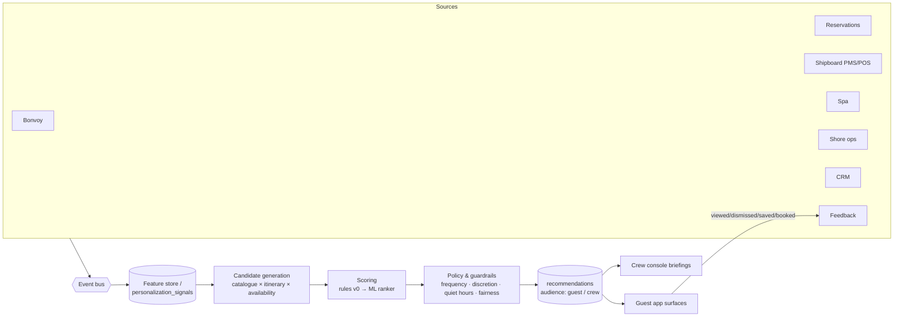

# 10 · Personalization Architecture

## Purpose

Determine the **next-best experience** and the **next-best service gesture** for each guest, on each surface, at each journey phase. The goal is guest delight and relationship value, *not* engagement or upsell volume. A recommendation that feels like an advertisement has failed.

## Signals

| Signal | Source | Example use |
|---|---|---|
| Bonvoy status | Bonvoy | Privilege eligibility, priority spa scheduling |
| Historical voyages | Reservations | "Welcome back"; avoid repeating an itinerary |
| Voyage history (what the guest did on each voyage) | `voyage_history` ([18](18-voyage-history.md)) | The engine's `history`: dining, spa and excursion moments with their weights, ratings and tags |
| Suite preferences | CRM / shipboard PMS | Turndown and amenity preparation |
| Dining history | Shipboard POS | Chef's Counter for guests who enjoyed tasting menus |
| Spa history | Spa system | Repeat a favourite therapist or treatment |
| Excursion history | Shore ops | Wine-led excursions for guests who loved a tasting |
| Destinations visited | Reservations | Lead with *new* experiences in familiar ports |
| Future itinerary | Voyage | Time the offer to the right port day |
| Travel companions | Reservation party | Couples' experiences; activities the companion enjoys |
| Special occasions | CRM | Anniversary gestures, respecting `recognition` level |
| Customer lifetime value | CRM / finance (internal) | Service-recovery budget, ambassador assignment |
| Feedback | Surveys, ratings, `recommendation_feedback` | Down-rank dismissed categories |
| Previous service issues | Concierge / CRM | **Crew-only** recovery gestures |

## Pipeline

### Stages

1. **Candidate generation.** Experiences available on this voyage and in its ports, filtered by availability, party composition (minors, mobility) and dietary constraints.
2. **Scoring.**
   * *v1 (shipped):* the deterministic rules engine `rules-v1` ([below](#the-mvp-engine-rules-v1)), shared by the app's mock mode and `personalization-next-best`.
   * *v1:* a learning-to-rank model (gradient-boosted trees) on the feature store, served behind the same contract.
   * *v2:* contextual bandits for exploration within strict guardrails.
3. **Policy and guardrails.**
   * At most three guest-facing recommendations per surface.
   * Respect quiet hours and marketing consent.
   * Never surface a price-led "offer".
   * `private` occasions are never used.
   * Service-recovery and customer-lifetime-value (CLV) driven items go to the **crew only** (`audience = 'crew'`, enforced by RLS).
4. **Explainability.** Each recommendation stores its `drivers[]`, `model_version` and a human-language `rationale` ("Because you loved the Assyrtiko tasting on Santorini"). This supports trust and audit.
5. **Feedback loop.** `recordFeedback()` records `viewed / dismissed / saved / booked`; a dismissal suppresses the category for the rest of the voyage.

## The MVP engine (`rules-v1`)

The code is in `supabase/functions/_shared/personalization/`:

* `types.ts` defines the inputs and `PersonalizedRecommendation`;
* `engine.ts` holds the rules;
* `supabaseInputs.ts` loads the inputs server-side;
* `handler.ts` is the Edge Function's logic.

It has no imports beyond its own types, so the same file runs in Deno (the function), Node (tests and seed) and the app (mock mode). `src/services/personalization/buildInput.ts` maps the app's domain objects to the inputs.

### Deterministic

* There is no randomness, and no clock unless one is passed.
* Every input list is ordered by ID first, so the order of the inputs does not matter.
* Ties are broken by date, then ID.

`check:personalization` asserts all three.

### Inputs

| Input | From | Used for |
|---|---|---|
| Bonvoy status | `loyalty_memberships.tier` | A tie-breaker (+0.03) for private formats. Never a reason |
| Previous voyages | Past reservations | The voyage and year in "Recommended because you enjoyed…"; first visits |
| Current itinerary | `port_calls` | The date and destination, sea days, port days |
| Dining preferences | Preferences (cuisines, table, time, wine) | Restaurants on a free evening near the preferred time; wine ashore |
| Spa preferences | Preferences, and spa history from `voyage_history` | Treatments on a sea day, at the preferred time of day |
| Excursion and dining history | `voyage_history` moments (`historyFromVoyages`), then any history signal not already among them (`mergeHistory`) | Loved moments; −0.3 for group formats after a crowded tour; private style |
| Destination interests | Activity interests, preferred destinations | "Because … is one of your passions"; Riviera and Balearic port matches |
| Travel companion | Companions (and their interests) | "Camille loves gardens and art"; couples formats; minors exclude wine |
| Special occasion | Occasions during the voyage (not `private`) | The day itself, in that port |
| Current reservations | Bookings | Excludes what is booked or clashes; prefers free evenings and open days |
| Customer value segment | `guest_relationships.value_segment` (internal) | Only the action for an occasion: the Suite Ambassador arranges it personally. No score, no reason; stripped before the app |

### Rules and weights

| Rule | Weight |
|---|---|
| `occasion`: an experience for the occasion, on the day / in that port | 0.5 (0.3 on another day), +0.1 for a dinner on an anniversary or honeymoon |
| `history`: a loved moment (rated 4–5) with overlapping tags | 0.35 + 0.1 × overlap (max 3) × strength |
| `spa-sea-day`: a favourite or remembered treatment, on a sea day | 0.45 (0.25 without a sea-day slot) |
| `wine-destination`: wine interest, ashore | 0.3 (aboard 0.2), +0.05 for red-wine tags if they prefer reds |
| `companion`: the companion's interests / a couples format | 0.3 / 0.15 |
| `dining-preference`: window table / cuisine, on a free evening | 0.15 / 0.12 |
| `interest`: a stated interest | 0.2 |
| `private-style`: private format ashore, for a guest who prefers private | 0.12 |
| `destination`, `first-visit`, `open-day` | 0.08, 0.05, 0.05 |
| `bonvoy`: high tier, private format | 0.03 |
| Penalties: group format after a crowded tour; longer than their limit | −0.3; −0.15 |

The score is the sum, clamped to 0–1. Candidates below 0.25 are dropped. The reason is the strongest rule's sentence.

### Policy

* Nothing in the past.
* Nothing booked, unless every card is being explained (`includeBooked`).
* Nothing that clashes with a booking, and nothing sold out.
* No transfers (they are services).
* Minors exclude wine, and wheelchair use excludes walking.
* With personalised recommendations switched off, only the itinerary is used, with neutral reasons ("In Palma de Mallorca on Sunday 16 May.").
* Diversity: at most two per category before the rest.

**Actions:**

* a request for the best open slot (preferred time, no clash);
* otherwise, "Ask the concierge";
* for an occasion and a valued guest, "Ask your Suite Ambassador to arrange it";
* for a booked item, the calendar.

### The examples

| Situation | Recommendation |
|---|---|
| Anniversary on 20 May, in Monte Carlo | *Dinner on a Private Terrace*, 20 May, aboard in Monte Carlo: "For your 20th wedding anniversary on Thursday 20 May, in Monte Carlo." |
| Wine interest, Palma on day 2 | *Binissalem Vineyards & Lunch in Deià*: "For your love of wine: a private visit to the vineyards of Palma de Mallorca." With history, the reason recalls the Hvar vineyard lunch |
| Spa history, sea day on 17 May | *Deep-Tissue Recovery Massage*, 17 May, at sea: "Monday 17 May is a day at sea: time for a treatment like your deep-tissue massage aboard Ilma." |

### The score is internal

`relevanceScore` ranks and filters only:

* no screen renders it (`check:personalization` scans every component);
* reasons never mention it, or tiers or segments;
* the value segment is an `internal` signal that `toGuestSafe` removes before anything leaves the server or the mock.

The Edge Function audits the engine version, rule IDs and signal kinds, never reasons or values.

## Surfaces

| Surface | Audience | Example |
|---|---|---|
| `home` | Guest | "Couples Terrace Suite in Portofino: for the morning of your anniversary." |
| `discover` | Guest | "Open-water swim from the marina: James swam every morning in the Cyclades." |
| `concierge` | Guest (AI context) | Suggested follow-up questions |
| `voyage` | Guest | "Suggested for you" lines in the day's programme |
| `crew-console` | Crew | "Acknowledge last voyage's delayed tender in Mykonos." |

## Service opportunities (crew-facing)

The same engine produces **service gestures** for the Suite Ambassador. Examples: a preferred amenity before embarkation, an acknowledgement of a past service issue, a discreet anniversary touch, or the guest's preferred table being held. These never appear in the guest app. They power the "she remembered" moments that define luxury hospitality.

## Privacy and ethics

* Personalization is based on legitimate interest within the guest relationship. Marketing uses require consent (`communication.marketingConsent`).
* No sensitive inference: no health, religion or finances beyond what the guest has explicitly shared.
* Guests can view and correct their preferences in Profile, and can opt out of personalised recommendations.
* Model and rule changes are versioned and reviewed by hospitality leadership.
